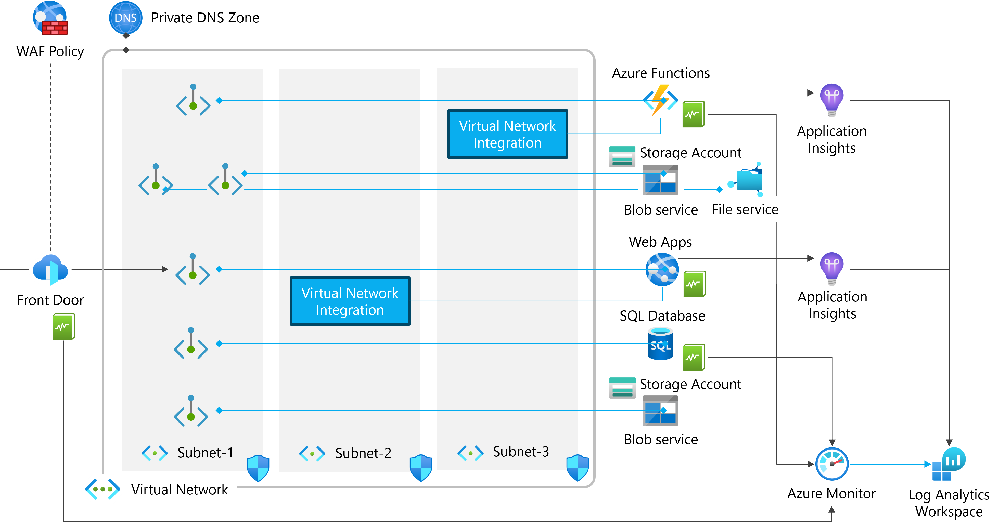
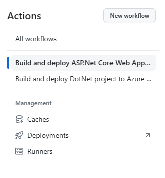
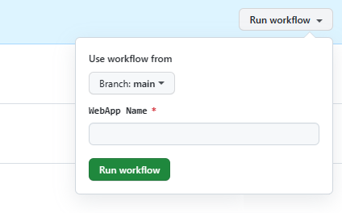
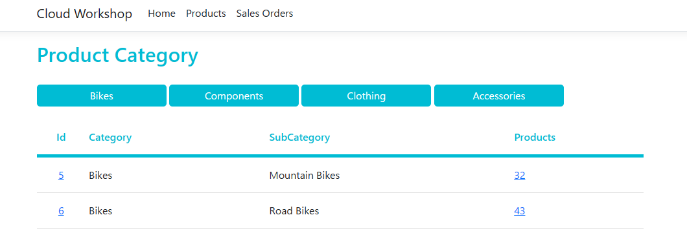
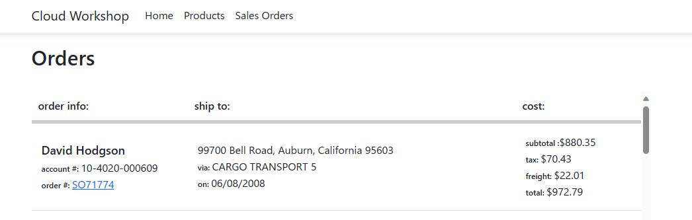
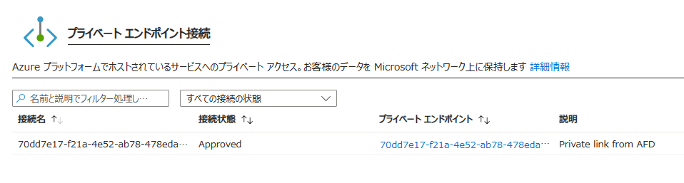

Monitoring Azure PaaS
Jan. 2024

<br />

### 参考情報

- [名前付け規則を定義する](https://learn.microsoft.com/ja-jp/azure/cloud-adoption-framework/ready/azure-best-practices/resource-naming)

- [Azure リソースの種類に推奨される省略形](https://learn.microsoft.com/ja-jp/azure/cloud-adoption-framework/ready/azure-best-practices/resource-abbreviations)

<br />

### 事前準備環境



<br />

### リソースの展開

Virtual Network (Subnet x3), Network Security Group x3, Private DNS Zone x4 (Blob, Files, SQL, Web sites),
Private Endpoint x5 (Blob x2, Files, SQL Server, Azure Functions),
Log Analytics Workspace, Storage Account x2, Azure Functions Premium, Web Apps, Application Insights, SQL Database

<br />

[](https://portal.azure.com/#create/Microsoft.Template/uri/https%3A%2F%2Fraw.githubusercontent.com%2Fhiroyay-ms%2FMonitoring-Azure-PaaS%2Fmain%2Ftemplates%2Fdeploy-resources.json)

**パラメーター**

- **virtualNetwork**: 仮想ネットワーク名 (2 ～ 64 文字/英数字、アンダースコア、ピリオド、およびハイフン)

- **addressPrefix**: IPv4 アドレス空間

- **subnet1**: サブネットの名前 (1) (1 ～ 80 文字/英数字、アンダースコア、ピリオド、およびハイフン)

- **subnet1Prefix**: サブネット アドレス範囲 (1)

- **subnet2**: サブネットの名前 (2) (1 ～ 80 文字/英数字、アンダースコア、ピリオド、およびハイフン)

- **subnet2Prefix**: サブネット アドレス範囲 (2)

- **subnet3**: サブネットの名前 (3) (1 ～ 80 文字/英数字、アンダースコア、ピリオド、およびハイフン)

- **subnet3Prefix**: サブネット アドレス範囲 (3)

- **storageAccountName**: ストレージ アカウントの名前 (3 ～ 24 文字/英小文字・数字のみ)

- **functionStorage**: ストレージ アカウントの名前 (Azure Functions 用) (3 ～ 24 文字/英小文字・数字のみ)

- **baseResourceName**: リソースのベースとなる名前、リソースの省略形を接頭語として使用

  ※ Azure Functions, Web App, SQL Server にも使用するため一意となる文字列を入力 

- **sqlAdministratorLogin**: SQL Server 管理者 (英数字)

- **sqlAdministratorPassword**: 管理者パスワード (8 ～ 128 文字/英大文字、英小文字、数字 (0 ～ 9)、英数字以外の文字のうち３つを含む)

※ 事前にリソース グループの作成が必要

※ 選択したリソース グループのリージョンにすべてのリソースを展開

<br />

### アプリケーションの展開

- サービス プリンシパルの作成

  ```
  az ad sp create-for-rbac --name "myApp" --role contributor --scopes /subscriptions/{subscription-id}/resourceGroups/{resource-group} --json-auth
  ```

  ※ 名前は任意、サブスクリプションID、リソース グループは展開先となる値に変更

  ※ 出力された JSON オブジェクトをコピー

- リポジトリを使用する GitHub アカウントへフォーク

- **Settings** タブの **Secrets and variables** - **Actions** を選択

- **New repository secret** をクリックし、新しいリポジトリ シークレットを作成

  - **Name**: AZURE_CREDENTIALS

  - **Secret**: サービス プリンシパル作成時に出力された JSON

- **Actions** タブを選択、画面左のメニューから **Build and deploy ASP.NET Core Web App to Azure App Service** を選択

  

- **Run workflow** をクリックし、展開先となる Web App 名を入力、**Run workflow** をクリック

  

- 同様の手順で展開先となる Function App 名を入力し **Build and deploy DotNet project to Azure Function App** を実行

- Azure ポータルへ移動、Web App, Function App が展開されていることを確認

  - Web App の概要から **既定のドメイン** の URL をクリック

  - アプリが正常に動作し、データベースから取得した値が表示されることを確認

    - **Home**

      
    
    - **Products**

      
    
    - **Sales Orders**

      

<br />

### リソースの更新

Disabled public access (Storage Account, Azure Functions, Web Apps)

Adding disgnostics settings (Azure Functions, Web App, SQL Database, Blob service)

Deploy Azure Front Door Premium, Load Testing

<br />

[](https://portal.azure.com/#create/Microsoft.Template/uri/https%3A%2F%2Fraw.githubusercontent.com%2Fhiroyay-ms%2FMonitoring-Azure-PaaS%2Fmain%2Ftemplates%2Fupdate-resources.json)

### パラメーター

- **storageAccountName**: リソース展開時に指定したストレージ アカウント名

- **functionStorage**: リソース展開時に指定したストレージ アカウント名 (Azure Functions 用)

- **baseResourceName**: リソース展開時に指定したベースの名前

<br />

※ Web App のプライベート エンドポイントの構成

- Web App 管理ブレードから **ネットワーク** を選択、**受信トラフィック** の **1 プライベート エンドポイント** をクリック

- Front Door 展開時に作成されたプライベート エンドポイントを選択し **承諾** をクリック

- **接続状態** が **Approved** に変更されることを確認

  

<br />

※ アプリの動作確認

- Web App 管理ブレードの **概要** から **既定のドメイン** の URL をクリック

- インターネットを介してのアクセスが無効であることを確認

  

- Front Door 管理ブレードの **概要** から **エンドポイント** の **エンドポイントのホスト名** をコピー

- Web ブラウザーのアドレス バーに貼り付け、アプリが正常に動作し、データベースから取得した値が表示されることを確認

    - **Home**

      
    
    - **Products**

      
    
    - **Sales Orders**

      
