Monitoring Azure PaaS
Jan. 2024

 

### Index

 

### 事前準備環境

 

## Exercise 1: クラウド リソースの正常性評価

### Task 1: サービス正常性アラートの作成

- Azure ポータルのトップ画面から検索バーに **サービス正常性** と入力

- 表示される候補より **サービス正常性** を選択

  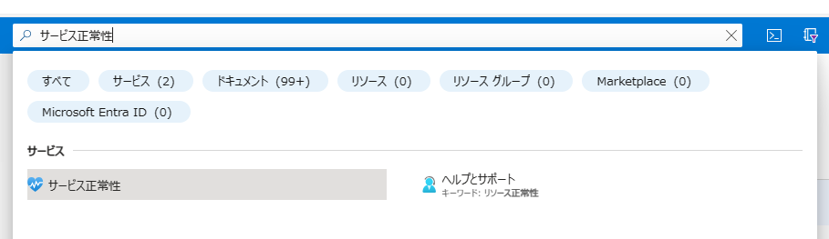

- 停止、計画メンテナンス、その他の正常性に関する情報など、サービスに影響を及ぼす問題が発生していないかを確認

  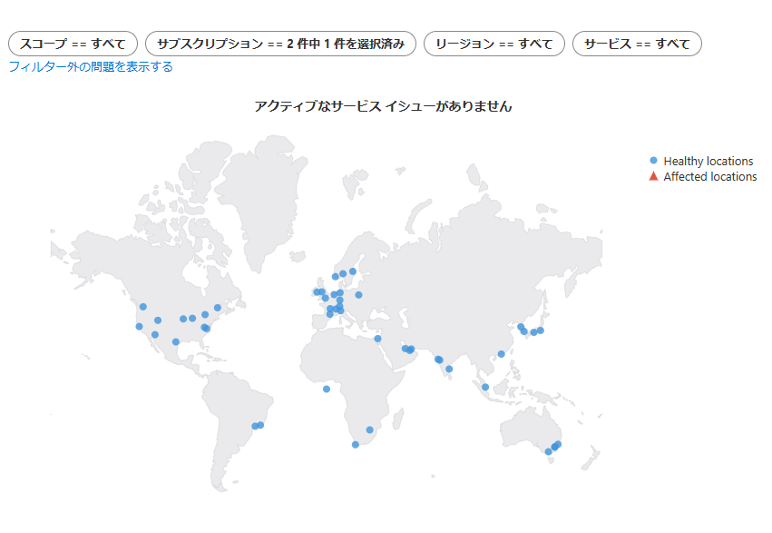

- **サービス正常性アラートの作成** をクリック

  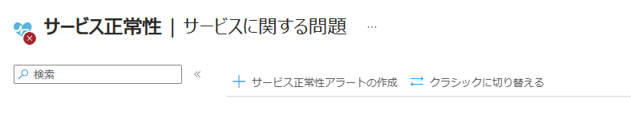

- アラート ルールの作成

  - **スコープ** で対象となるサブスクリプションを選択

    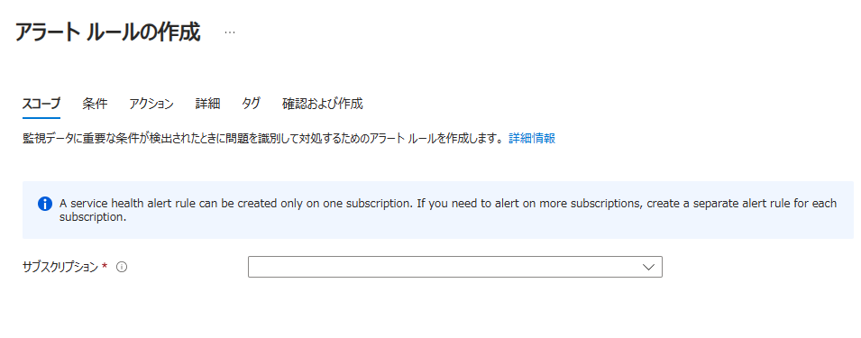

  - **条件** で **サービス**、**地域**、**イベントの種類** を選択

    - **サービス**: 使用中のサービスを選択
    
      例）App Service (Linux) ¥ Web Apps, Front Door, Functions, SQL Database, Storage

      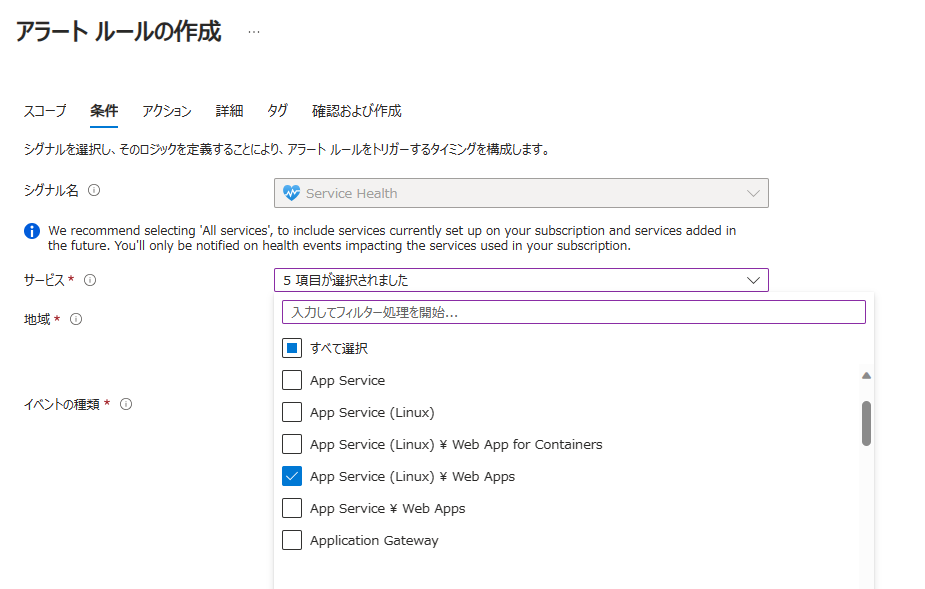
    
    - **地域**: 使用中のリージョンを選択

      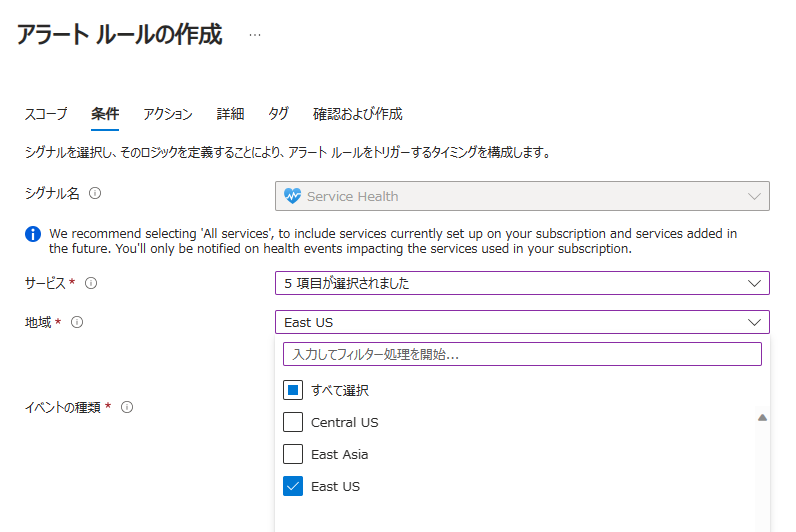

    - **イベントの種類**: サービスの問題、計画メンテナンスを選択

      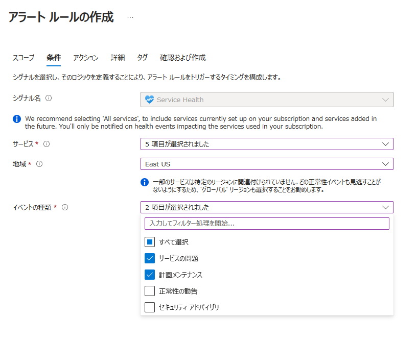

  - **アクション** で **アクション グループの作成** をクリック

    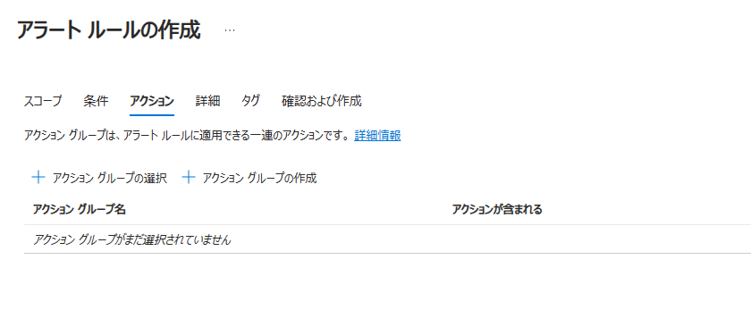

   

    - アクション グループの作成

      - **基本**

        - **プロジェクトの詳細**

          - **サブスクリプション**: 使用中のサブスクリプション

          - **リソース グループ**: 使用中のリソース グループ

          - **リージョン**: グローバル
        
        - **インスタンスの詳細**

          - **アクション グループ名**: ag-Email (任意)

          - **表示名**: ag-Email (任意)

        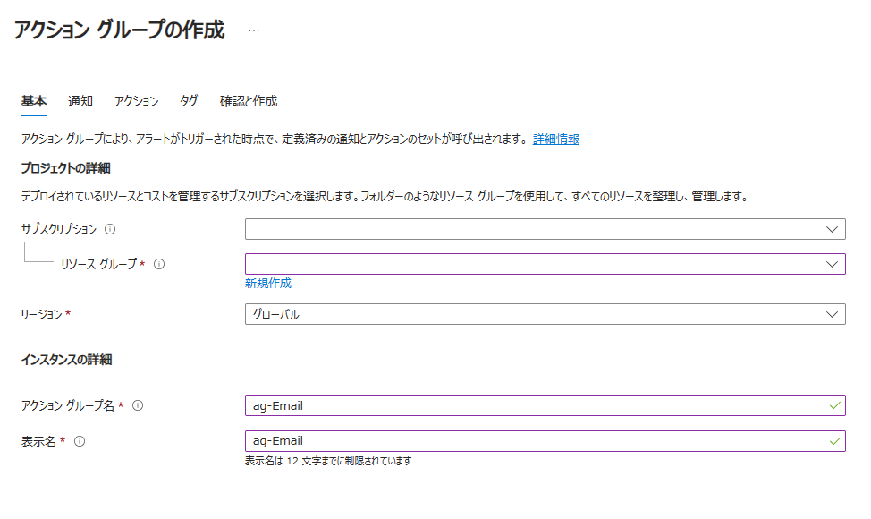
    
      - **通知**

        - **通知タイプ**: 電子メール/SNS メッセージ/プッシュ/音声

        - **名前**: email (任意)

          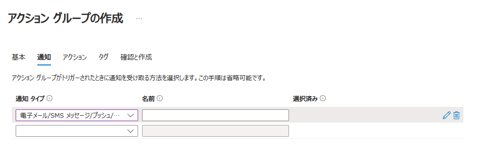

          ※電子メールにチェックし、通知先のメールアドレスを入力

          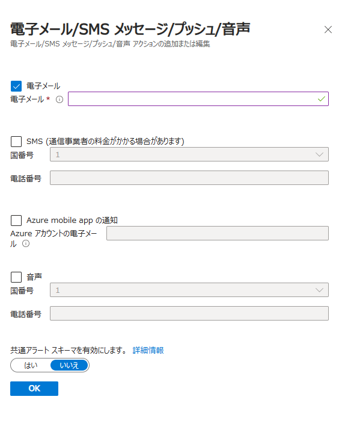
    
      - **確認および作成** をクリック

      - 指定した内容に問題がないことを確認し、**作成** をクリック

  - **アクション** に作成したアクション グループが表示されていることを確認

    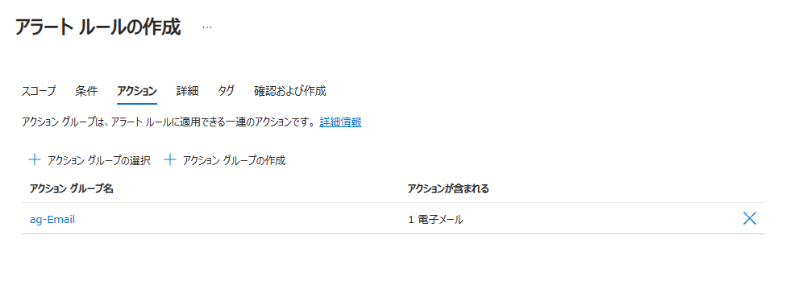

  - **詳細** でリソース グループを選択し、アラート ルール名を入力

    - **リソース グループ**: 使用中のリソース グループ

    - **アラート ルール名**: alert-Service-Health (任意)

    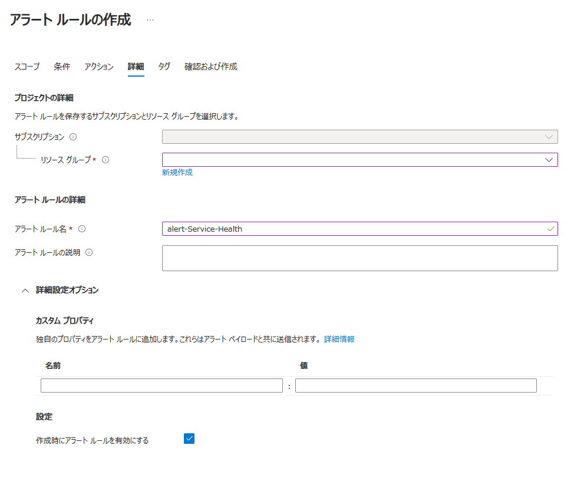

  - **確認および作成** をクリック

  - 指定した内容を確認し **作成** をクリック

 

### Task 2: リソース正常性アラートの作成

- サービス正常性ダッシュボードの左側メニューで **リソース正常性** を選択

  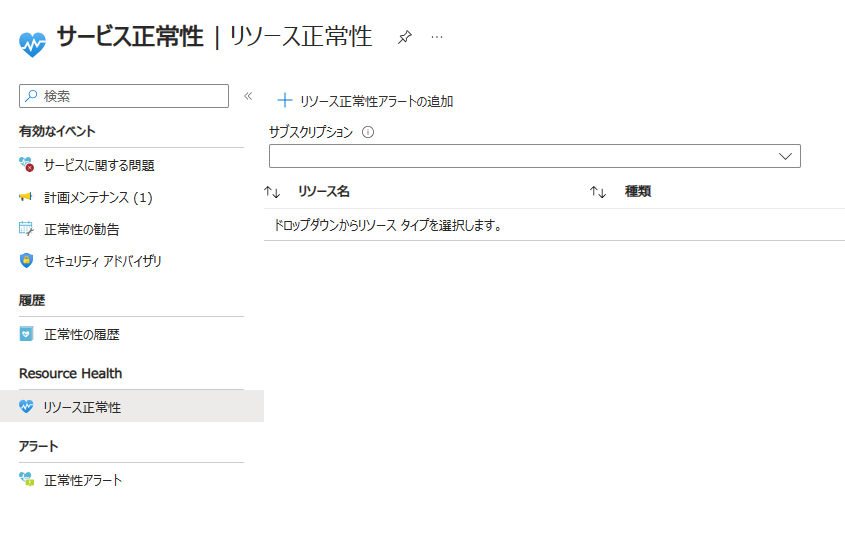

- アラート ルールの作成

  - **スコープ**

    - **サブスクリプション**: 使用中のサブスクリプション

    - **リソース グループ**: 使用中のリソース グループ

    - **リソースの種類**: すべて選択

    - **リソース**: すべて選択

    - **今後すべてのリソースを含める**: オン

      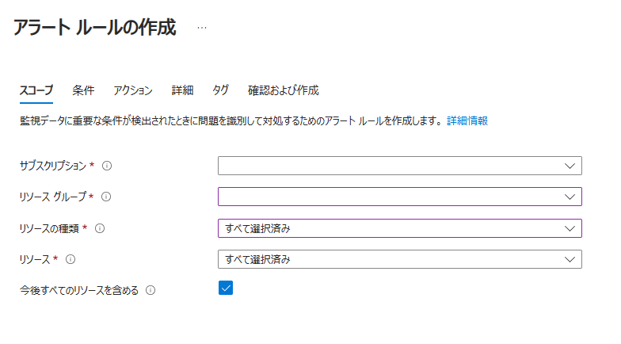

  - **条件**

    - **イベントの種類**: Active, Resolved

    - **現在のリソースの状態**: Degraded, Unavailable

    - **以前のリソースの状態**: Available

    - **理由の種類**: すべて選択

      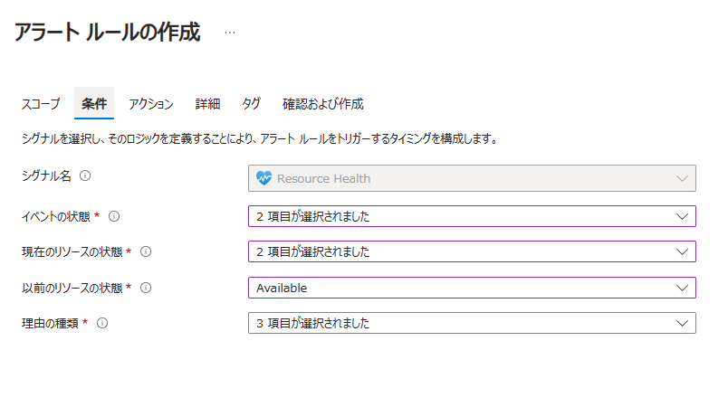

  - **アクション**

    - **アクション グループの選択** をクリックし、サービス正常性アラートで作成したアクション グループを選択

      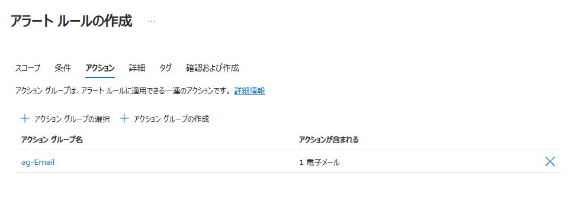

  - **詳細**

    - **プロジェクトの詳細**

      - **サブスクリプション**: 使用中のサブスクリプション

      - **リソース グループ**: 使用中のリソース グループ

    - **アラート ルールの詳細**

      - **アラート ルール名**: alert-Resource-Health (任意)

      - **作成時にアラート ルールを有効にする**: オン

      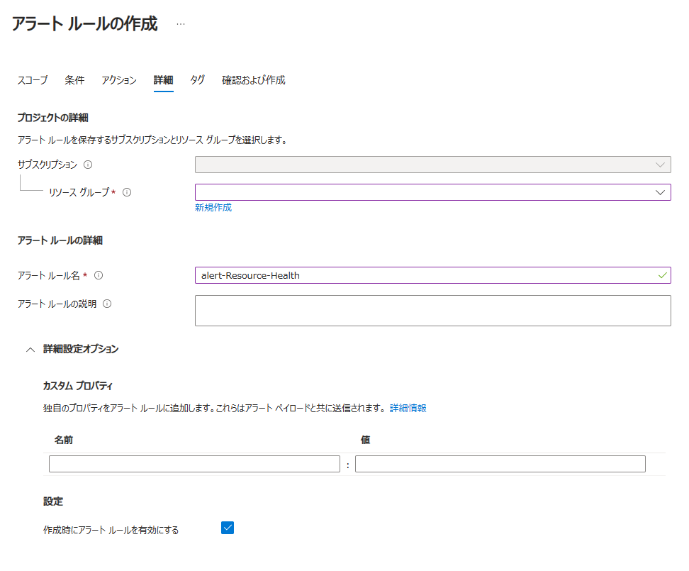

  - **確認および作成** をクリック

  - 指定した内容を確認し **作成** をクリック

  #### 参考情報

  [リソースの正常性と種類](https://learn.microsoft.com/ja-jp/azure/service-health/resource-health-checks-resource-types)

 

## Exercise 2: Web サイトの稼働状況の確認

### Task 1: Application Insights 標準テストの作成

- Application Insights の管理ブレードから **有効** を選択

- **標準テストの追加** をクリック

  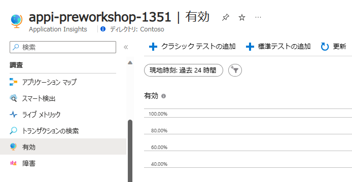

- 標準テストの作成

  - **テスト名**: 任意

  - **URL**: https:// {Front Door のエンドポイントのホスト名} /

  - **従属要求の解析**: オフ

  - **可用性テストが失敗した場合の再試行を有効にする**: オン

  - **SSL 証明書の有効性を有効にする**: オン

    - **プロアクティブな有効期間のチェック**: 7 日

  - **テストの頻度**: 5 分

  - **テストの場所**: 任意 (アプリケーションを展開している地域以外を 5 箇所選択)

  - **アラートの状態**: 有効

    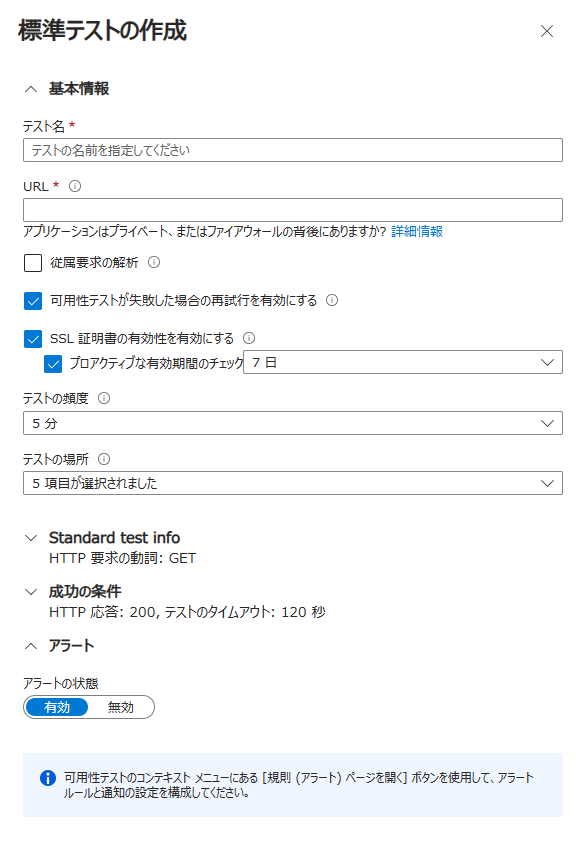

- **作成** をクリック

  ※ テスト名-Application Insights 名でアラート ルールが作成

- 作成した標準テストの **...** をクリックし、**規則 (アラート) ページを開く** をクリック

  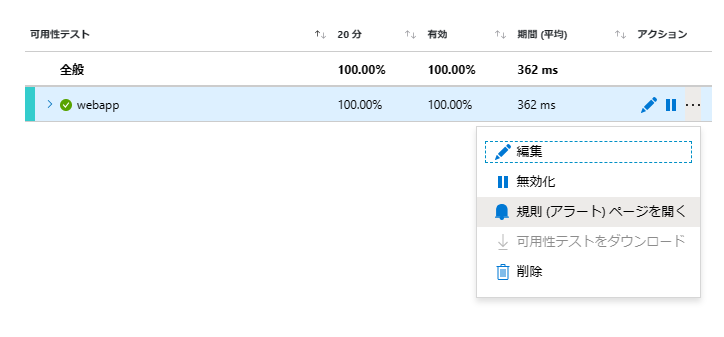

- 標準テスト作成時に作成されたアラート ルールをクリック

  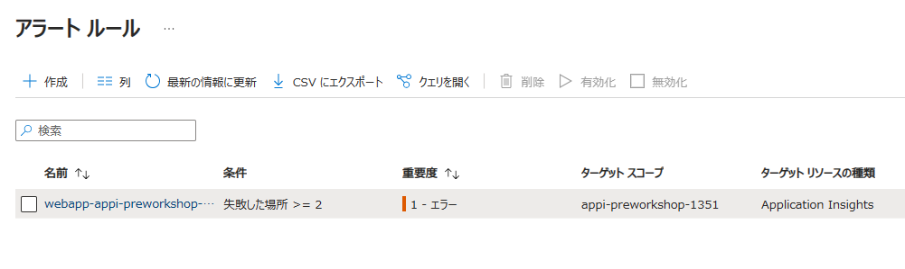

- **アクション グループ** の **アクション グループの管理** をクリック

  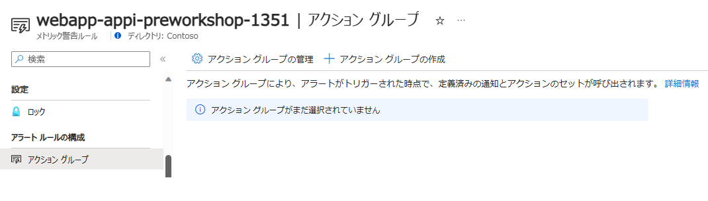

- 正常性アラート作成時に使用したアクション グループを選択

- **適用** をクリック

- **概要** を選択し **編集** をクリック

- 標準テストの作成時に生成されたアラートの内容を確認

  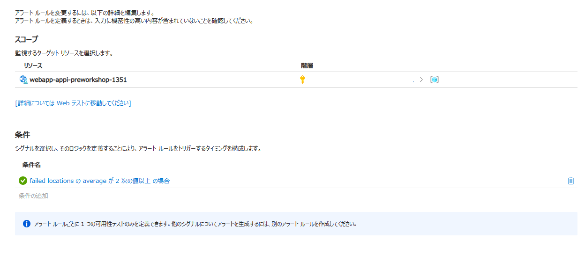

  ※ 2 箇所以上、テストが失敗した際にアラートを発報

- テスト結果は折れ線グラフと散布図で視覚化

  - 折れ線グラフ

    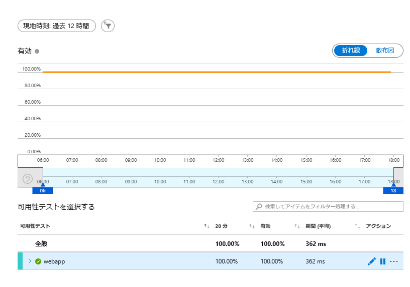

  - 散布図

    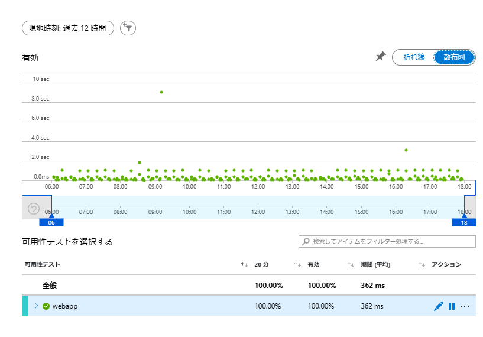

  ※ 散布図では、緑/赤色の点上にポインタを置くことで、テスト、結果、場所などを確認可

  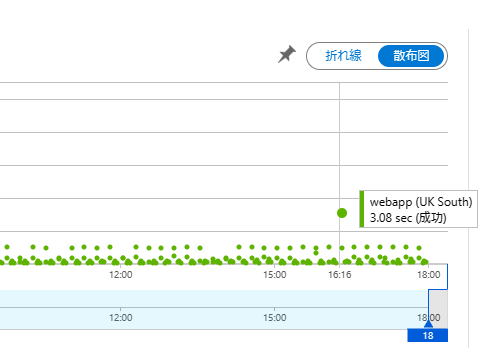

 

### Task 2: App Service インスタンスの監視

- Web App 管理ブレードの **正常性チェック** を選択

- 正常性チェックを有効化し、必要項目を選択後、**保存** をクリック

  - **正常性チェック**: 有効化

  - **正常性プローブ パス**: /HealthCheck

  - **負荷分散のしきい値**: 10分

  - **診断の収集**: 無効化

    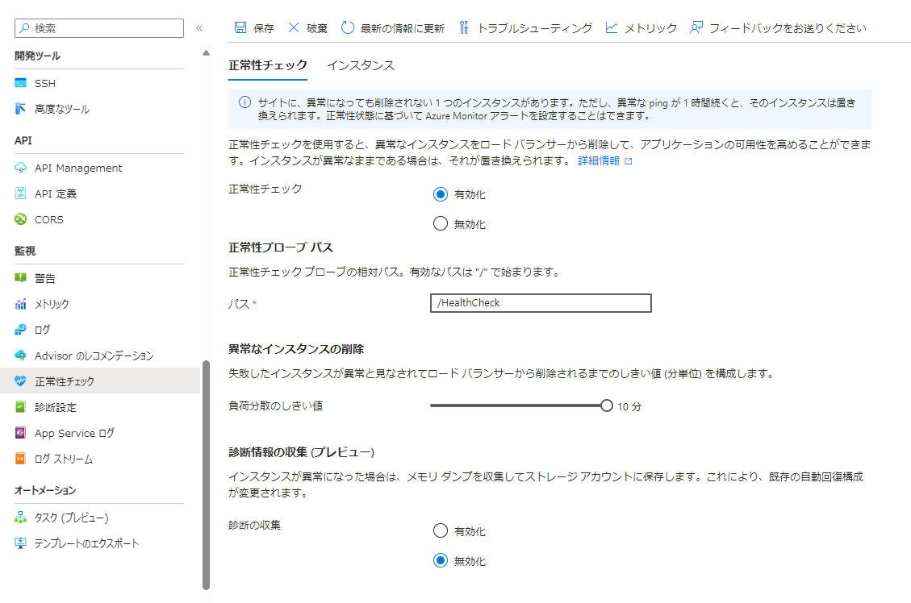

- **警告** を選択、**作成** ‐ **アラート ルール** をクリック

  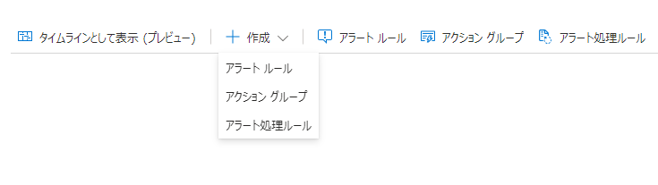

- **アラート ルールの作成**

  - **条件**

    - **シグナル名**: Health check status

    - **アラート ロジック**

      - **しきい値**: Static

      - **集計の種類**: 平均

      - **演算子**: 次の値より小さい

      - **単位**: カウント

      - **しきい値**: 100
    
    - **ディメンションで分割する**

      - **ディメンション名**: Instance

      - **演算子**: =

      - **ディメンション値**: 読み込まれた値

      - **今後すべての値を含める**: オン

    - **評価するタイミング**

      - **確認する間隔**: 1 分

      - **ルックバック期間**: 5 分

        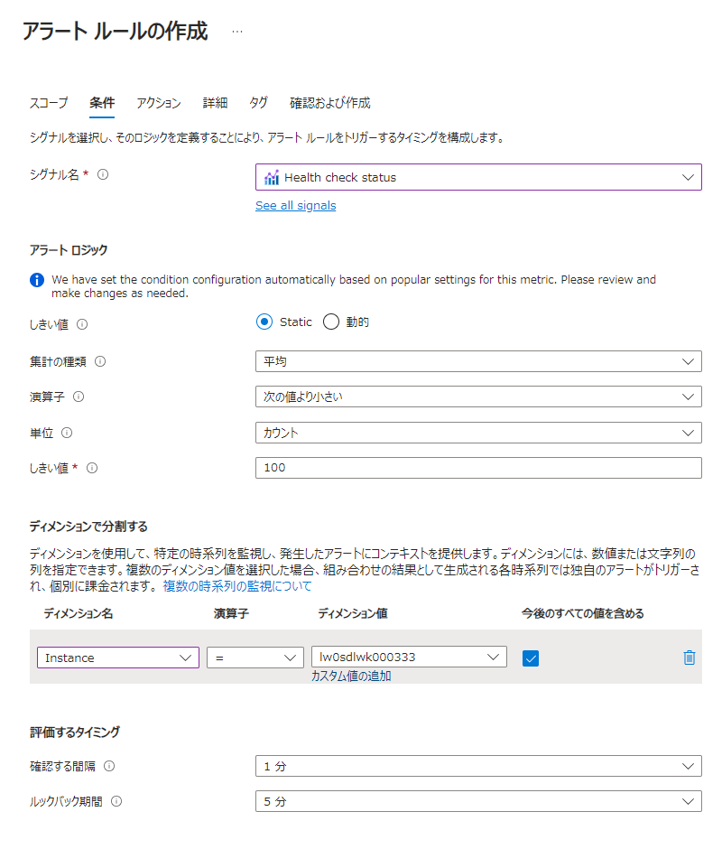

  - **アクション**

    - ワークショップ中に作成したアラート グループを選択

      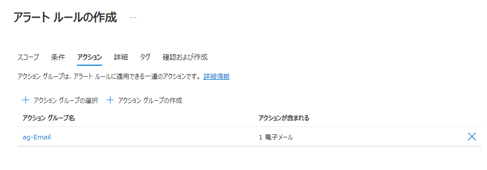
  
  - **詳細**

    - **プロジェクトの詳細**

      - **サブスクリプション**: 使用中のサブスクリプション

      - **リソース グループ**: 使用中のリソース グループ

    - **アラート ルールの詳細**

      - **重大度**: 1 ‐ エラー

      - **アラート ルール名**: webapp-health-check-alert (任意)

    - **詳細設定オプション**

      - **作成時に有効化**: オン

      - **アラートを自動的に解決する**: オン

        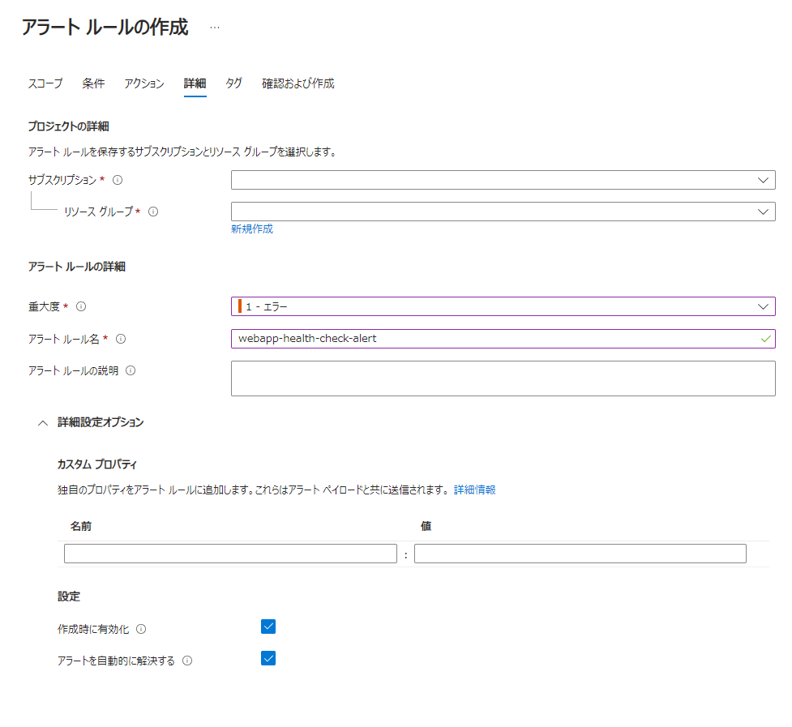

  - **確認および作成** をクリック

- 指定した内容を確認し **作成** をクリック

 

