Monitoring Azure PaaS
Jan. 2024

<br />

### Index

<br />

### 事前準備環境


<br />

## Exercise 1: クラウド リソースの正常性評価

### Task 1: サービス正常性アラートの作成

- Azure ポータルのトップ画面から検索バーに **サービス正常性** と入力

- 表示される候補より **サービス正常性** を選択

  

- 停止、計画メンテナンス、その他の正常性に関する情報など、サービスに影響を及ぼす問題が発生していないかを確認

  

- **サービス正常性アラートの作成** をクリック

  

- アラート ルールの作成

  - **スコープ** で対象となるサブスクリプションを選択

    

  - **条件** で **サービス**、**地域**、**イベントの種類** を選択

    - **サービス**: 使用中のサービスを選択
    
      例）App Service (Linux) ¥ Web Apps, Front Door, Functions, SQL Database, Storage

      
    
    - **地域**: 使用中のリージョンを選択

      

    - **イベントの種類**: サービスの問題、計画メンテナンスを選択

      

  - **アクション** で **アクション グループの作成** をクリック

    

  <br />

    - アクション グループの作成

      - **基本**

        - **プロジェクトの詳細**

          - **サブスクリプション**: 使用中のサブスクリプション

          - **リソース グループ**: 使用中のリソース グループ

          - **リージョン**: グローバル
        
        - **インスタンスの詳細**

          - **アクション グループ名**: ag-Email (任意)

          - **表示名**: ag-Email (任意)

        
    
      - **通知**

        - **通知タイプ**: 電子メール/SNS メッセージ/プッシュ/音声

        - **名前**: email (任意)

          

          ※電子メールにチェックし、通知先のメールアドレスを入力

          
    
      - **確認および作成** をクリック

      - 指定した内容に問題がないことを確認し、**作成** をクリック

  - **アクション** に作成したアクション グループが表示されていることを確認

    

  - **詳細** でリソース グループを選択し、アラート ルール名を入力

    - **リソース グループ**: 使用中のリソース グループ

    - **アラート ルール名**: alert-Service-Health (任意)

    

  - **確認および作成** をクリック

- 指定した内容を確認し **作成** をクリック

<br />

### Task 2: リソース正常性アラートの作成

- サービス正常性ダッシュボードの左側メニューで **リソース正常性** を選択

  

- アラート ルールの作成

  - **スコープ**

    - **サブスクリプション**: 使用中のサブスクリプション

    - **リソース グループ**: 使用中のリソース グループ

    - **リソースの種類**: すべて選択

    - **リソース**: すべて選択

    - **今後すべてのリソースを含める**: オン

      

  - **条件**

    - **イベントの種類**: Active, Resolved

    - **現在のリソースの状態**: Degraded, Unavailable

    - **以前のリソースの状態**: Available

    - **理由の種類**: すべて選択

      

  - **アクション**

    - **アクション グループの選択** をクリックし、サービス正常性アラートで作成したアクション グループを選択

      

  - **詳細**

    - **プロジェクトの詳細**

      - **サブスクリプション**: 使用中のサブスクリプション

      - **リソース グループ**: 使用中のリソース グループ

    - **アラート ルールの詳細**

      - **アラート ルール名**: alert-Resource-Health (任意)

      - **作成時にアラート ルールを有効にする**: オン

      

  - **確認および作成** をクリック

- 指定した内容を確認し **作成** をクリック

#### 参考情報

[リソースの正常性と種類](https://learn.microsoft.com/ja-jp/azure/service-health/resource-health-checks-resource-types)

<br />

## Exercise 2: Web サイトの稼働状況の確認

### Task 1: Application Insights 標準テストの作成

- Application Insights の管理ブレードから **有効** を選択

- **標準テストの追加** をクリック

  

- 標準テストの作成

  - **テスト名**: 任意

  - **URL**: https:// {Front Door のエンドポイントのホスト名} /

  - **従属要求の解析**: オフ

  - **可用性テストが失敗した場合の再試行を有効にする**: オン

  - **SSL 証明書の有効性を有効にする**: オン

    - **プロアクティブな有効期間のチェック**: 7 日

  - **テストの頻度**: 5 分

  - **テストの場所**: 任意 (アプリケーションを展開している地域以外を 5 箇所選択)

  - **アラートの状態**: 有効

    

- **作成** をクリック

  ※ テスト名-Application Insights 名でアラート ルールが作成

- 作成した標準テストの **...** をクリックし、**規則 (アラート) ページを開く** をクリック

  

- 標準テスト作成時に作成されたアラート ルールをクリック

  

- **アクション グループ** の **アクション グループの管理** をクリック

  

- 正常性アラート作成時に使用したアクション グループを選択

- **適用** をクリック

- **概要** を選択し **編集** をクリック

- 標準テストの作成時に生成されたアラートの内容を確認

  

  ※ 2 箇所以上、テストが失敗した際にアラートを発報

- テスト結果は折れ線グラフと散布図で視覚化

  - 折れ線グラフ

    

  - 散布図

    

  ※ 散布図では、緑/赤色の点上にポインタを置くことで、テスト、結果、場所などを確認可

  

<br />

### Task 2: App Service インスタンスの監視

- Web App 管理ブレードの **正常性チェック** を選択

- 正常性チェックを有効化し、必要項目を選択後、**保存** をクリック

  - **正常性チェック**: 有効化

  - **正常性プローブ パス**: /HealthCheck

  - **負荷分散のしきい値**: 10分

  - **診断の収集**: 無効化

    

- **警告** を選択、**作成** ‐ **アラート ルール** をクリック

  

- **アラート ルールの作成**

  - **条件**

    - **シグナル名**: Health check status

    - **アラート ロジック**

      - **しきい値**: Static

      - **集計の種類**: 平均

      - **演算子**: 次の値より小さい

      - **単位**: カウント

      - **しきい値**: 100
    
    - **ディメンションで分割する**

      - **ディメンション名**: Instance

      - **演算子**: =

      - **ディメンション値**: 読み込まれた値

      - **今後すべての値を含める**: オン

    - **評価するタイミング**

      - **確認する間隔**: 1 分

      - **ルックバック期間**: 5 分

        

  - **アクション**

    - ワークショップ中に作成したアラート グループを選択

      
  
  - **詳細**

    - **プロジェクトの詳細**

      - **サブスクリプション**: 使用中のサブスクリプション

      - **リソース グループ**: 使用中のリソース グループ

    - **アラート ルールの詳細**

      - **重大度**: 1 ‐ エラー

      - **アラート ルール名**: webapp-health-check-alert (任意)

    - **詳細設定オプション**

      - **作成時に有効化**: オン

      - **アラートを自動的に解決する**: オン

        

  - **確認および作成** をクリック

- 指定した内容を確認し **作成** をクリック

<br />

## Exercise 3: Application Insights ログ ベースのメトリックの使用

### Task 1: アプリケーションの正常性とパフォーマンスの確認

- Application Insights 管理ブレードを表示

- **概要** ウィンドウでアプリケーションの正常性とパフォーマンスを確認

  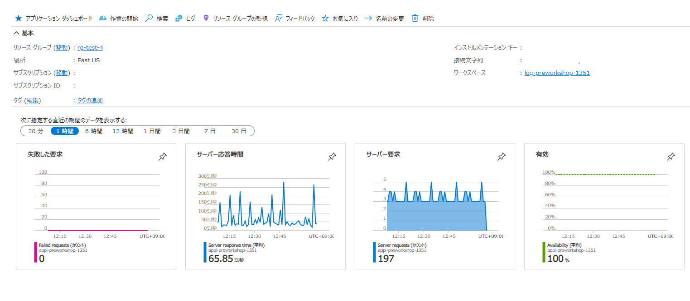

  ※画面上部で表示する時間範囲を選択可

- 左側のメニューで **アプリケーション マップ** を選択

- アプリケーションの論理構造を表示

  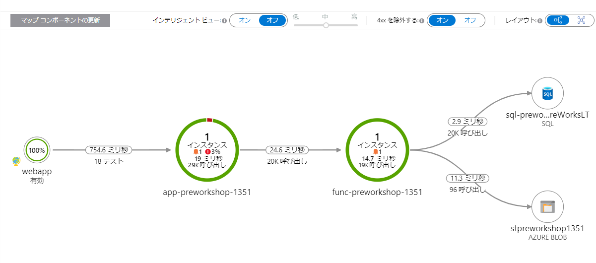

  ※個々のコンポーネントは記録されたテレメトリの roleName または name プロパティで特定

- 左側のメニューで **障害** を選択、失敗した要求を確認

  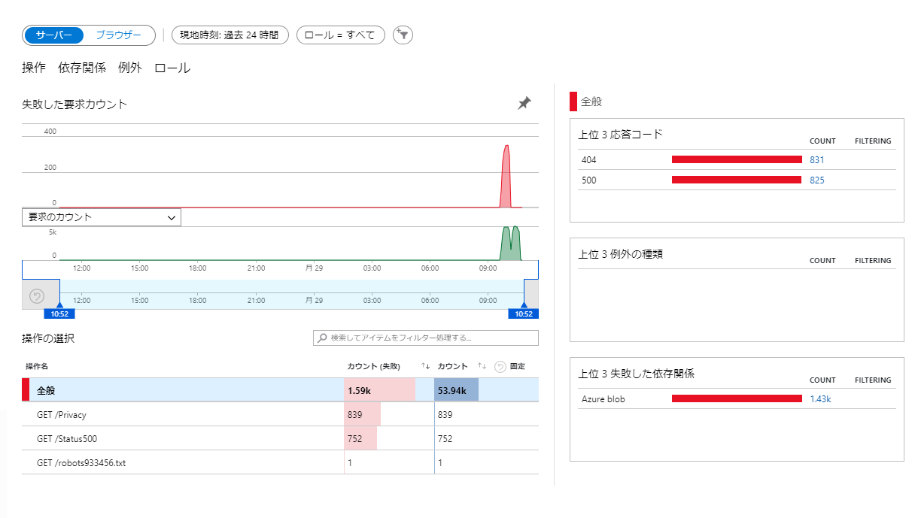

  ※ robots933456.txt はコンテナーが要求を処理できるか確認するために App Service が使用するダミーの URLのため無視して OK

  ※ 404 応答であるがコンテナーが正常であり、要求に応答できる状態であることを App Service に通知

- **上位 3 失敗した依存関係** の **Azure blob** をクリック、依存関係のサンプルを選択

  

- **エンドツーエンド トランザクションの詳細** 画面で要求の継続時間とコンポーネントの依存関係を確認

  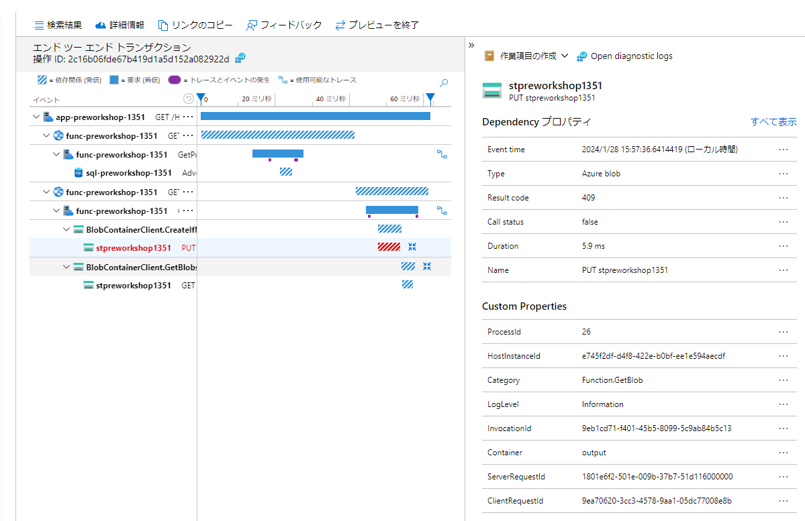

  ※コンポーネント呼び出しは、呼び出し元コンポーネントからの送信と呼び出し先コンポーネントの受信要求の２行で表示

  ※Azure Functions から CreateIfNotExists でコンテナーが存在しない場合は作成するコードを実行

  ※409 応答は、コンテナーがすでに存在する場合の応答のため無視して OK

- **障害** ウィンドウを表示、**ログに表示** ‐ **失敗した要求カウント** を選択

  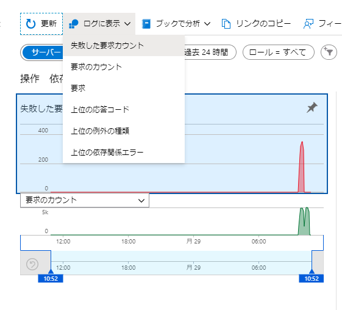

- **ログ** ウィンドウで生成されたクエリが実行され、結果を表示

  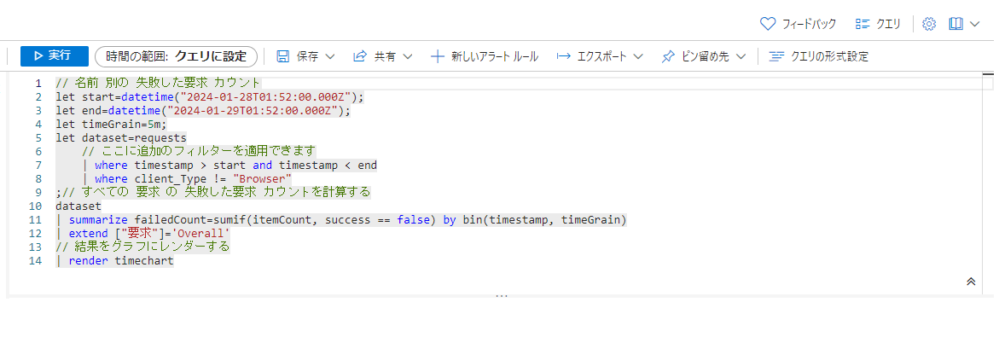

- 左側のメニューで **アラート** を選択、**＋ 作成** ‐ **アラート ルール** をクリック

- **アラート ルールの作成**

  - **条件**

    - **シグナル名**: Failed requests

    - **アラート ロジック**

      - **しきい値**: Static

      - **集計の種類**: カウント

      - **演算子**: 次の値より大きい

      - **単位**: カウント

      - **しきい値**: 0

    - **評価するタイミング**

      - **確認する間隔**: 1 分

      - **ルックバック期間**: 5 分

        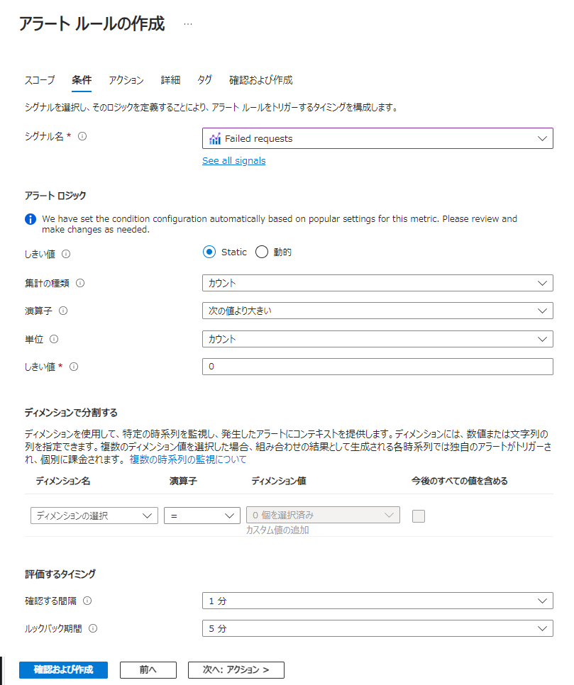
  
  - **アクション**

    - アクション グループの選択でワークショップ中に作成したアクション グループを選択

      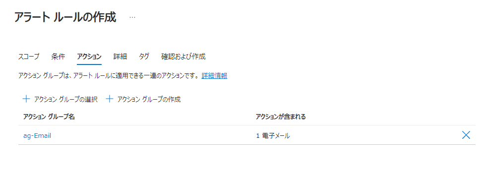

  - **詳細**

    - **プロジェクトの詳細**

      - **サブスクリプション**: ワークショップで使用中のサブスクリプション

      - **リソース グループ**: ワークショップで使用中のリソース グループ

    - **アラート ルールの詳細**

      - **重大度**: 0 ‐ 重大

      - **アラート ルール名**: failed-request-alert (任意)
    
    - **詳細設定オプション**

      - **作成時に有効化**: オン

      - **アラートを自動的に解決する**: オン (条件が満たされた場合、アクションを１回のみ起動)

        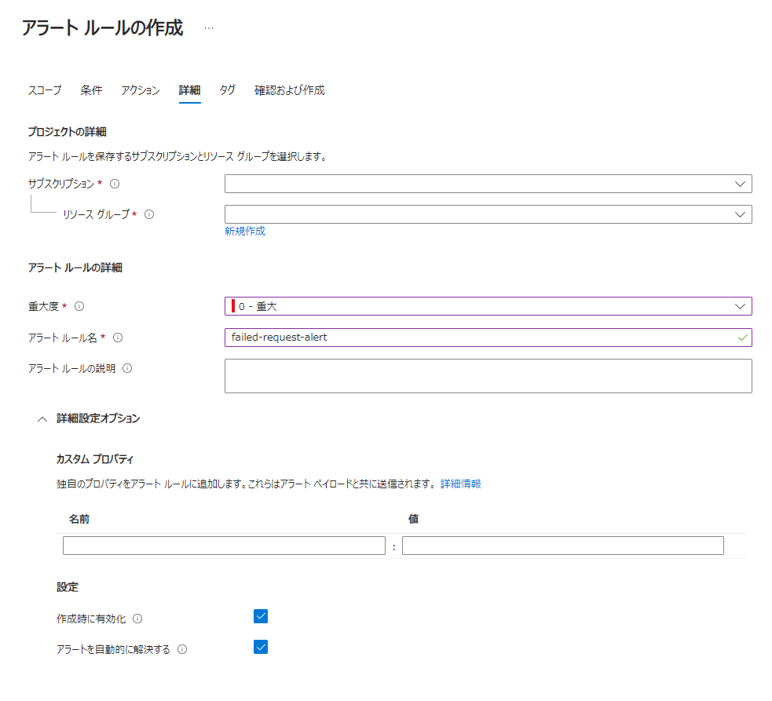

  - **確認および作成** をクリック

- 指定した内容を確認し **作成** をクリック

<br />

- 左側のメニューで **パフォーマンス** を選択し、ウィンドウを表示

- グラフではマウスのドラッグ操作で時間範囲の選択が可

  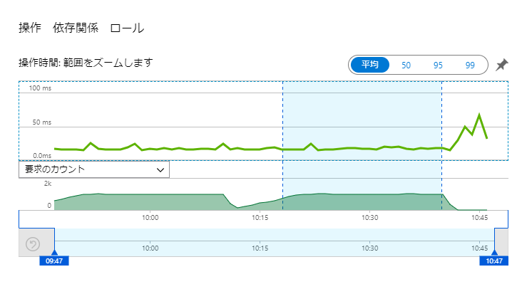

  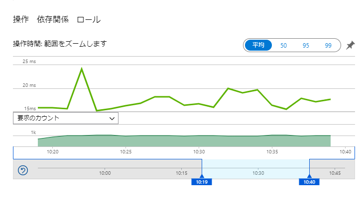

- **操作名** に表示されるイベントでのフィルタリングが可

  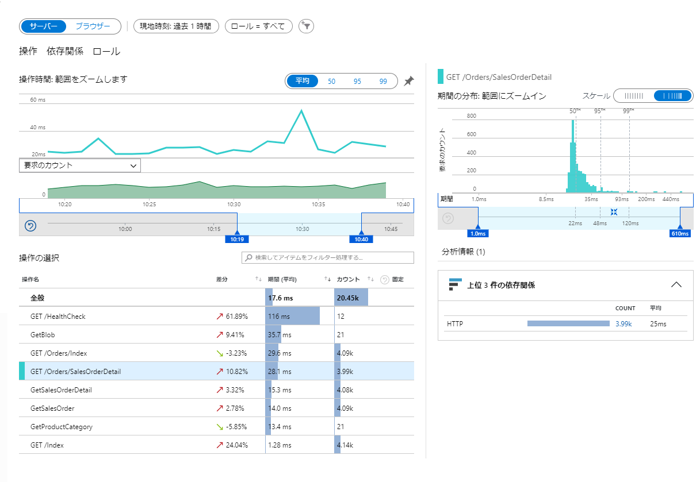

- **ログに表示** - **応答時間** を選択

  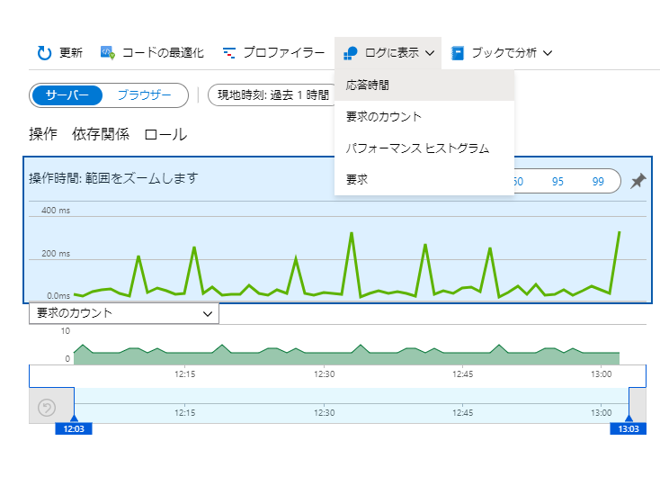

- **ログ** ウィンドウで生成されたクエリが実行され、結果を表示

  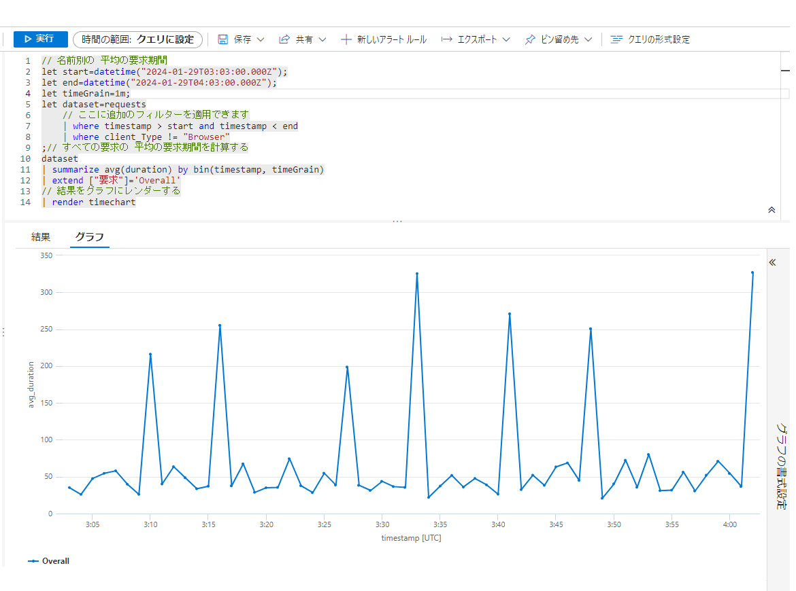

  ※クエリの実行エラーが発生した場合は、空白行を削除し再実行

- 左側のメニューで **アラート** を選択、**＋ 作成** ‐ **アラート ルール** をクリック

- **アラート ルールの作成**

  - **条件**

    - **シグナル名**: Server response time

    - **アラート ロジック**

      - **しきい値**: Static

      - **集計の種類**: 平均

      - **演算子**: 次の値より大きい

      - **しきい値**: 2000

    - **評価するタイミング**

      - **確認する間隔**: 1 分

      - **ルックバック期間**: 5 分

        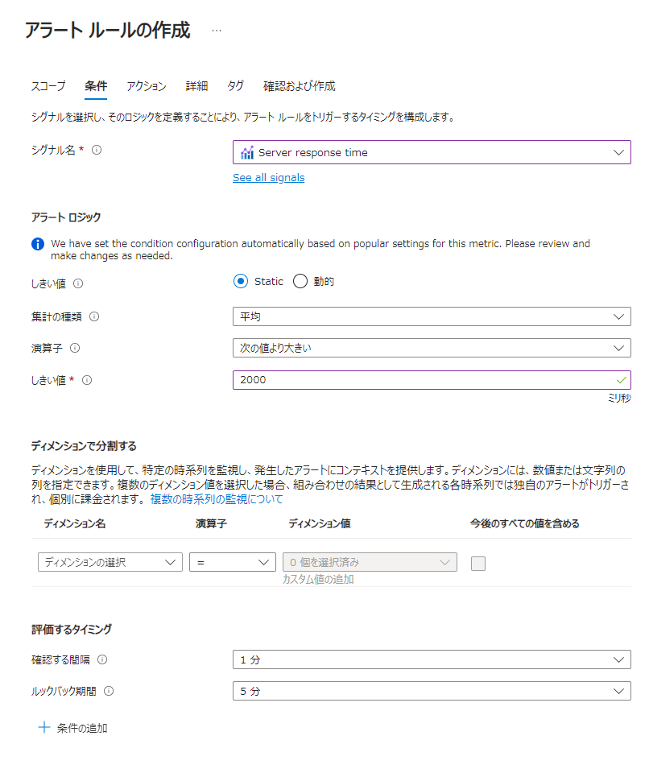
  
  - **アクション**

    - アクション グループの選択でワークショップ中に作成したアクション グループを選択

      

  - **詳細**

    - **プロジェクトの詳細**

      - **サブスクリプション**: ワークショップで使用中のサブスクリプション

      - **リソース グループ**: ワークショップで使用中のリソース グループ

    - **アラート ルールの詳細**

      - **重大度**: 2 ‐ 警告

      - **アラート ルール名**: webapp-performance-alert (任意)
    
    - **詳細設定オプション**

      - **作成時に有効化**: オン

      - **アラートを自動的に解決する**: オン

        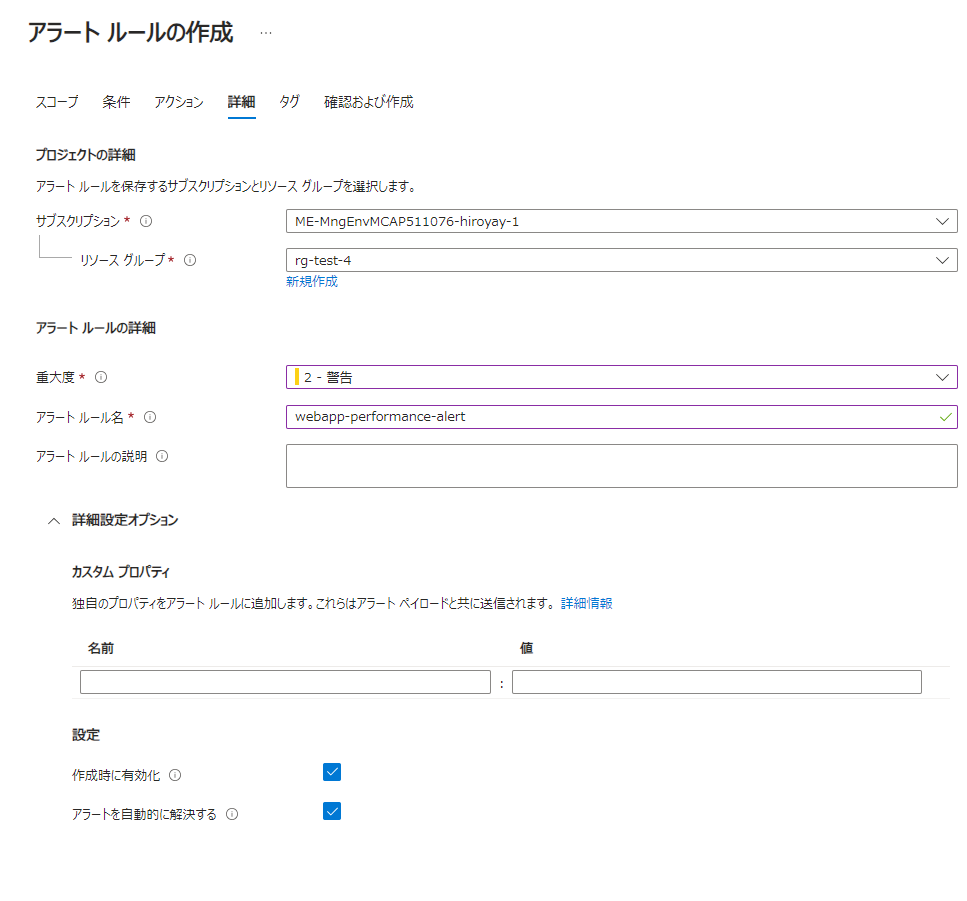

  - **確認および作成** をクリック

- 指定した内容を確認し **作成** をクリック

<br />

### Task 2: 格納されたログの確認

- 左側のメニューで **ログ** を選択

- **trace** テーブルをダブルクリックし、もしくは **trace** とクエリ ウィンドウに記述

  ```
  trace
  ```

- **実行** をクリックし、クエリを実行

  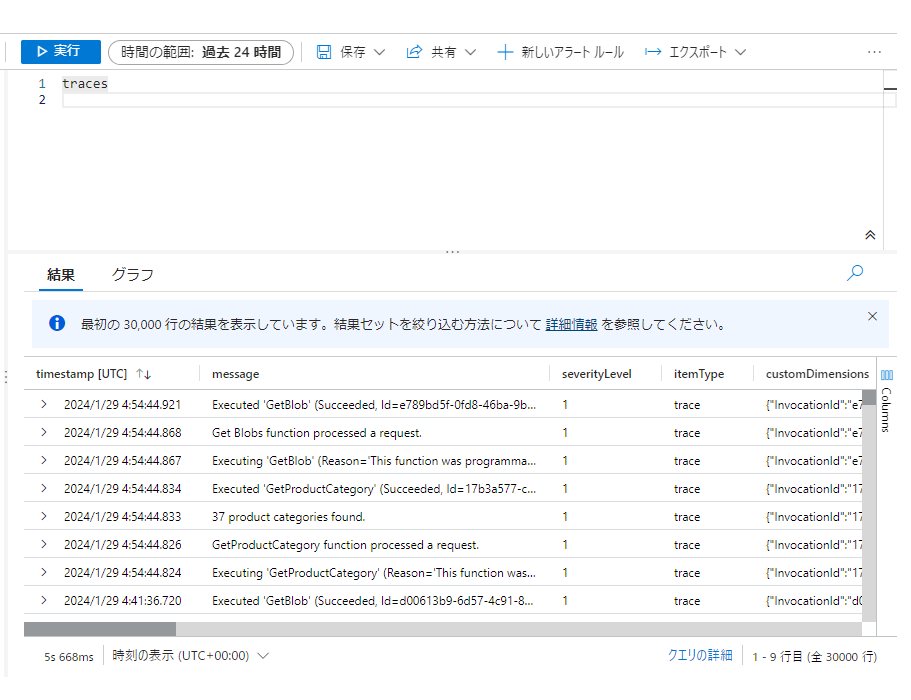

  ※trace テーブルには、アプリケーションから出力されたログを格納

- where 演算子によるフィルター処理

  ```
  trace
  | where operation_Name == 'GetProduct'
  ```

  ※KQL ではテーブル名、列名、演算子、関数など、すべてのものに対して大文字と小文字を区別

  ※trace テーブルへの参照から始まり、where 演算子を使用し operationName 列の値でフィルター処理を実行

  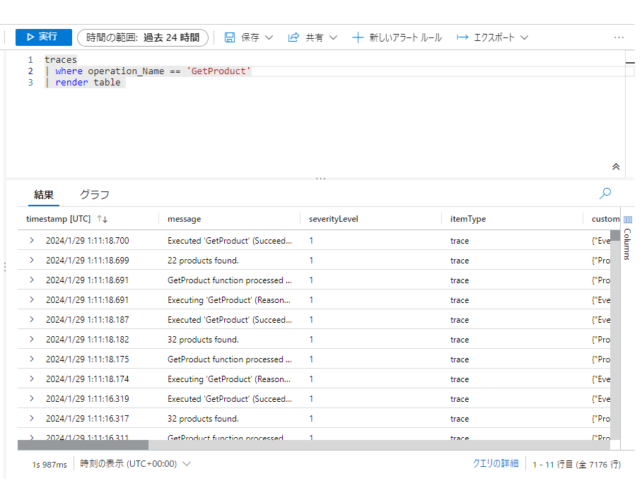

- 集計処理と視覚化

  ```
  trace
  | where timestamp > ago(12h)
  | summarize sum(itemCount) by bin(timestamp, 1h)
  | render barchart
  ```

  ※trace テーブルへの参照から始まり、where と summarize, render 演算子をパイプで区切り指定

  ※where 演算子を使用し timestamp 列の値でフィルター処理
  
  ※summarize 演算子を使用し itemCount の合計を１時間ごとにまとめた集計テーブルを生成

  ※render 演算子を使用し横棒グラフで視覚化

  ※演算子から演算子への情報のパイプ処理はシーケンシャルに実行されるためクエリ演算子の順序は重要

  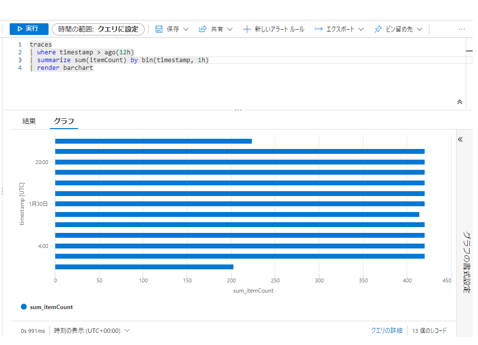

<br />

- request テーブルの内容を表示

  ```
  requests
  ```

  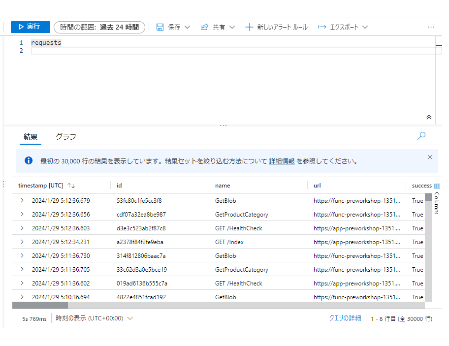

- 直近 3 時間のリクエスト回数をイベントごとにグラフで表示

  ```
  requests
  | where timestamp > ago(3h)
  | summarize count() by bin(timestamp, 1h), operation_Name
  | render columnchart with (kind=unstacked)
  ```

  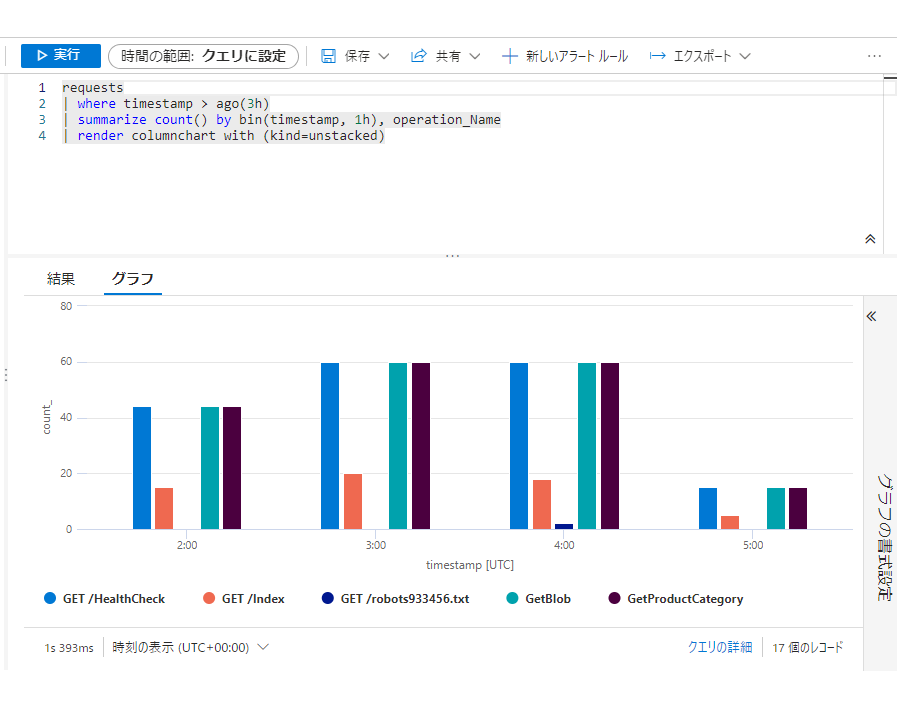

- エラーが発生したイベントと URL, ステータス コードを取得

  ```
  requests
  | where success == 'False'
  | project timestamp, operation_Name, url, resultCode
  ```

  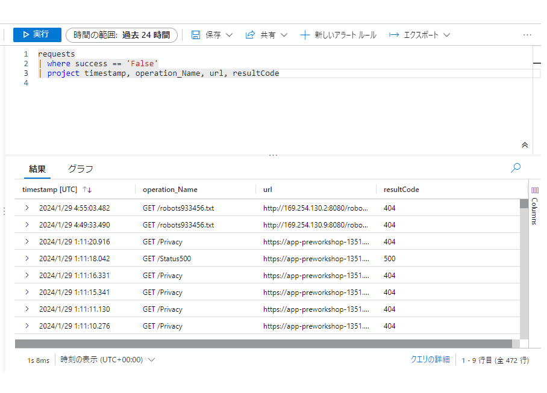


- HTTP ステータス コード 500 のエラーを取得

  ```
  requests
  | where success == 'False'
  | where resultCode == 500
  ```

  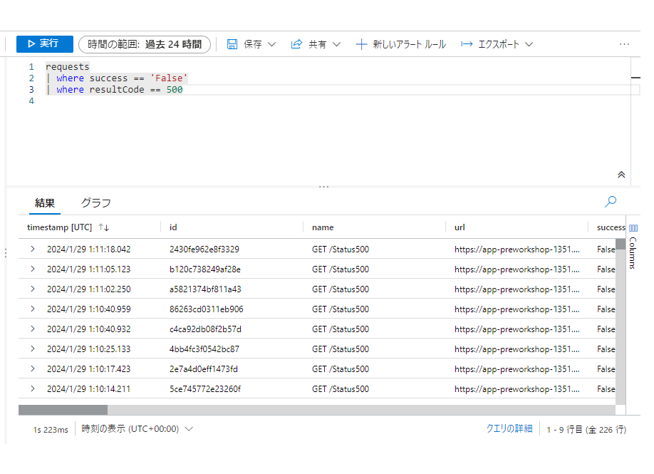

- **＋ 新しいアラート ルール** をクリック

- **アラート ルールの作成**

  - **条件**

    - **シグナル名**: カスタム ログ検索

    - **測定**

      - **メジャー**: テーブルの行

      - **集計の種類**: カウント

      - **集計の粒度**: 5 分

    - **アラート ロジック*

      - **演算子**: 次の値より大きい

      - **しきい値**: 0

      - **評価の頻度**: 5 分

        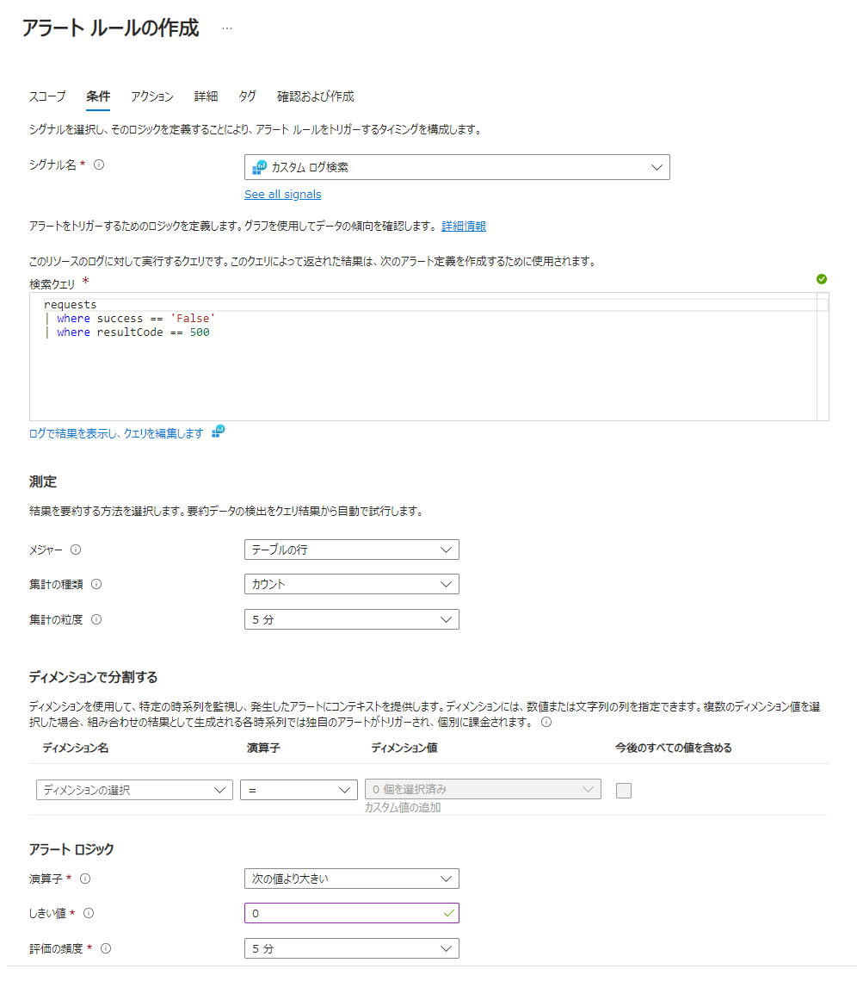
  
  - **アクション**

    - アクション グループの選択でワークショップ中に作成したアクション グループを選択

      

  - **詳細**

    - **プロジェクトの詳細**

      - **サブスクリプション**: ワークショップで使用中のサブスクリプション

      - **リソース グループ**: ワークショップで使用中のリソース グループ

    - **アラート ルールの詳細**

      - **重大度**: 0 ‐ 重大

      - **アラート ルール名**: http-status-500-error (任意)

      - **リージョン**: リソース グループと同じリージョン

        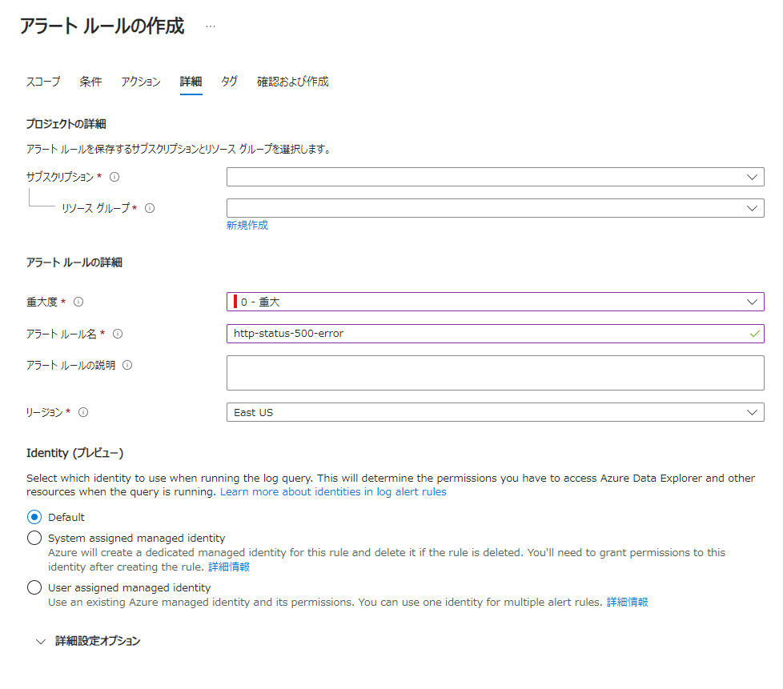

  - **確認および作成** をクリック

- 指定した内容を確認し **作成** をクリック

<br />

### 参考情報

- [Application Insights ログベースのメトリック](https://learn.microsoft.com/ja-jp/azure/azure-monitor/essentials/app-insights-metrics)

- [ログ リファレンス ‐ requests](https://learn.microsoft.com/ja-jp/azure/azure-monitor/reference/tables/requests)

- [ログ リファレンス ‐ trace](https://learn.microsoft.com/ja-jp/azure/azure-monitor/reference/tables/traces)

<br />

## Exercise 4: App Service メトリックによる視覚化とアラートの作成

### Task 1: 受信 HTTP 要求の確認

- Web App 管理ブレードを表示、左側のメニューから **ログ** を選択

- AppServiceHTTPLogs テーブルに格納されている情報を確認

  ```
  AppServiceHTTPLogs
  ```

  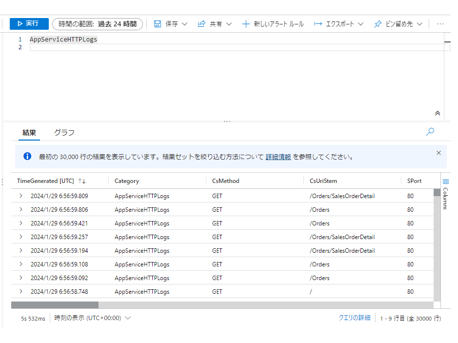

  ※アプリケーションの正常性、パフォーマンス、利用パターンの監視に使用できるログを格納

- 半日以内の HTTP ステータス コード 200 以外が返された回数を時間で集計し HTTP ステータス コードごとに表示

  ```
  AppServiceHTTPLogs
  | where ScStatus != 200
  | make-series num=count() default=0 on TimeGenerated from datetime_add('day', -1, now()) to now() step 1h by tostring(ScStatus)
  | render columnchart with (kind=unstacked)
  ```

  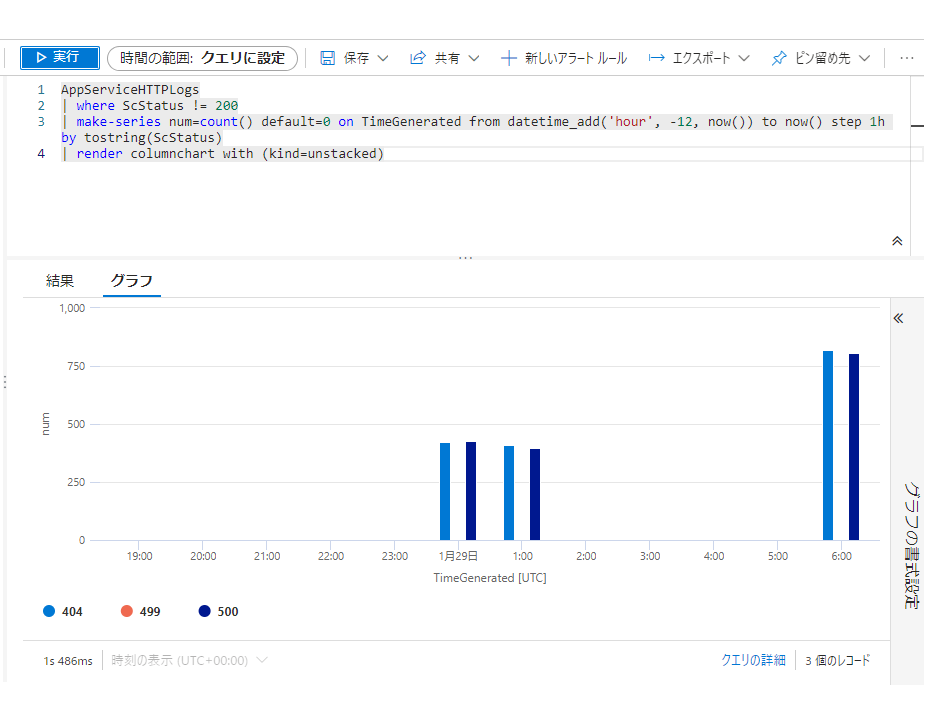

- AppServiceHTTPLogs と AppServiceConsoleLogs を統合し HTTP ステータス コード 200 以外を監視

  ```
  let httpLogs = AppServiceHTTPLogs | where TimeGenerated > ago(1d) | where  ScStatus == 500 | project TimeGen=substring(TimeGenerated, 0, 19), CsUriStem, ScStatus;
  let consoleLogs = AppServiceConsoleLogs | where TimeGenerated > ago(1d) | project TimeGen=substring(TimeGenerated, 0, 19), ResultDescription;
  httpLogs
  | join consoleLogs on TimeGen
  | project TimeGen, CsUriStem, ScStatus, ResultDescription
  ```

  ※エラー発生時のコンソール ログを取得

<br />

### 参考情報

- [ログ リファレンス ‐ AppServiceHTTPLogs](https://learn.microsoft.com/ja-jp/azure/azure-monitor/reference/tables/appservicehttplogs)

- [ログ リファレンス ‐ AppServiceConsoleLogs](https://learn.microsoft.com/ja-jp/azure/azure-monitor/reference/tables/appserviceconsolelogs)

<br />

### Task 2: App Service プラン メトリックの確認

- Web App 管理ブレードのメニューから **App Service プラン** を選択し App Service プランの管理ブレードを表示

‐ **概要** ウィンドウで CPU、メモリなどの情報を確認

  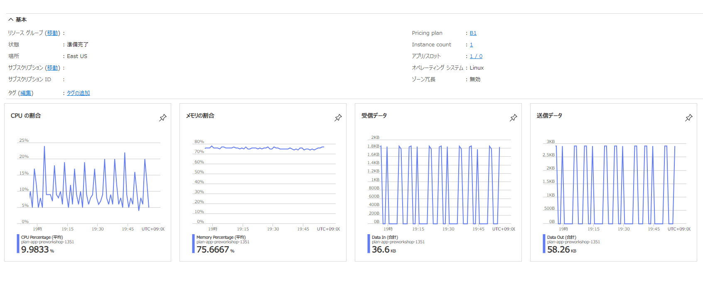

- **メトリック** を選択、**CPU Percentage**, **Memory Percentage** を選択し、リソースの消費状況を確認

  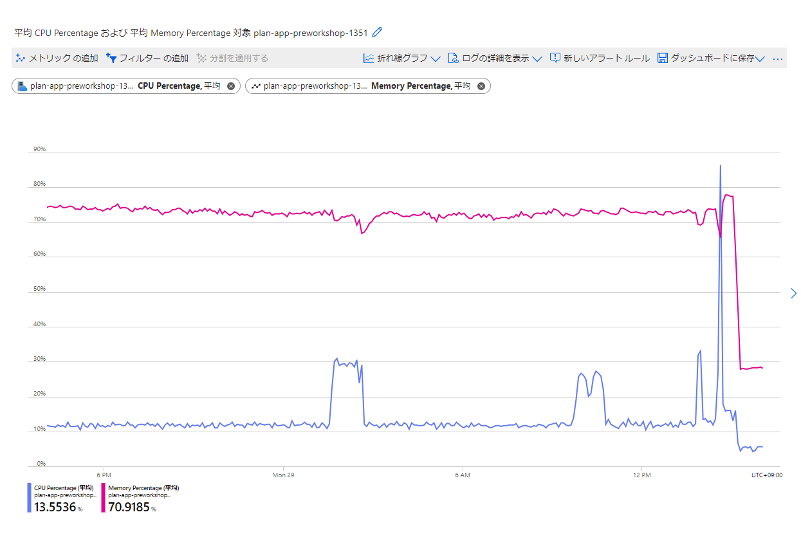

- **警告** を選択、**＋ 作成** ‐ **アラート ルール** をクリック

- **アラート ルールの作成**

  - **条件**

    - **シグナル名**: CPU Percentage

    - **アラート ロジック**

      - **しきい値**: Static

      - **集計の種類**: 平均

      - **演算子**: 次の値より大きい

      - **しきい値**: 80

    - **評価するタイミング**

      - **確認する間隔**: 1 分

      - **ルックバック期間**: 5 分

        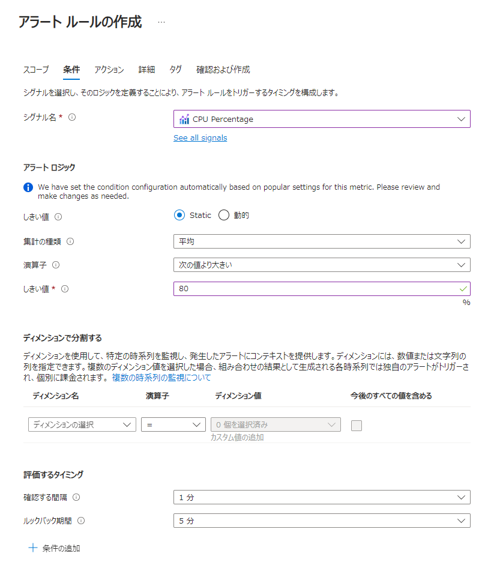
  
  - **アクション**

    - アクション グループの選択でワークショップ中に作成したアクション グループを選択

      

  - **詳細**

    - **プロジェクトの詳細**

      - **サブスクリプション**: ワークショップで使用中のサブスクリプション

      - **リソース グループ**: ワークショップで使用中のリソース グループ

    - **アラート ルールの詳細**

      - **重大度**: 2 ‐ 警告

      - **アラート ルール名**: app-service-plan-cpu-percentage-alert (任意)
    
    - **詳細設定オプション**

      - **作成時に有効化**: オン

      - **アラートを自動的に解決する**: オン

        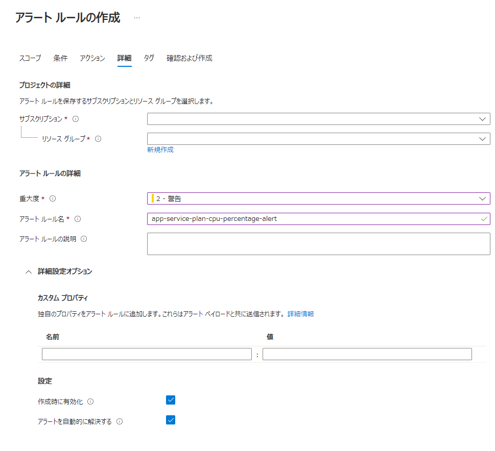

  - **確認および作成** をクリック

- 指定した内容を確認し **作成** をクリック

- 再度 **＋ 作成** ‐ **アラート ルール** をクリック

- **アラート ルールの作成**

  - **条件**

    - **シグナル名**: Memory Percentage

    - **アラート ロジック**

      - **しきい値**: Static

      - **集計の種類**: 平均

      - **演算子**: 次の値より大きい

      - **しきい値**: 80

    - **評価するタイミング**

      - **確認する間隔**: 1 分

      - **ルックバック期間**: 5 分

        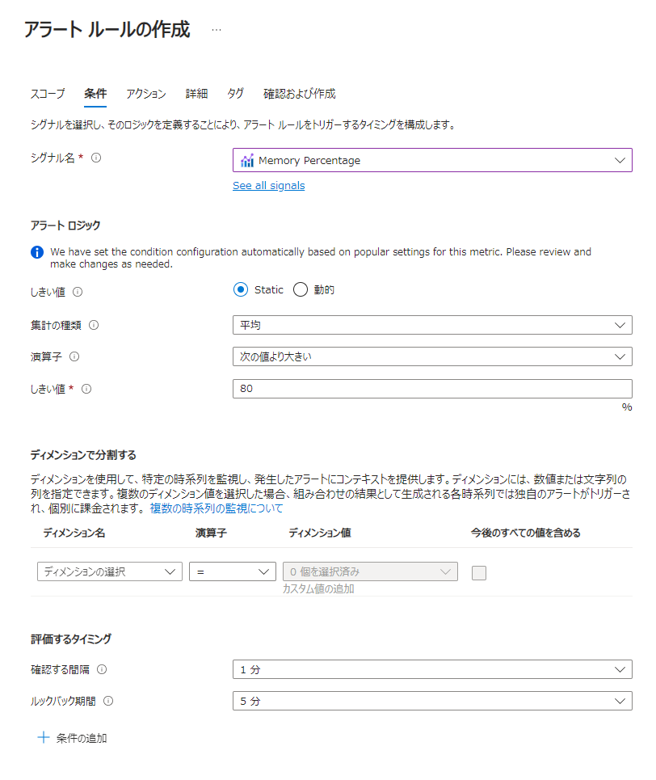
  
  - **アクション**

    - アクション グループの選択でワークショップ中に作成したアクション グループを選択

      

  - **詳細**

    - **プロジェクトの詳細**

      - **サブスクリプション**: ワークショップで使用中のサブスクリプション

      - **リソース グループ**: ワークショップで使用中のリソース グループ

    - **アラート ルールの詳細**

      - **重大度**: 2 ‐ 警告

      - **アラート ルール名**: app-service-plan-memory-usage-alert (任意)
    
    - **詳細設定オプション**

      - **作成時に有効化**: オン

      - **アラートを自動的に解決する**: オン

        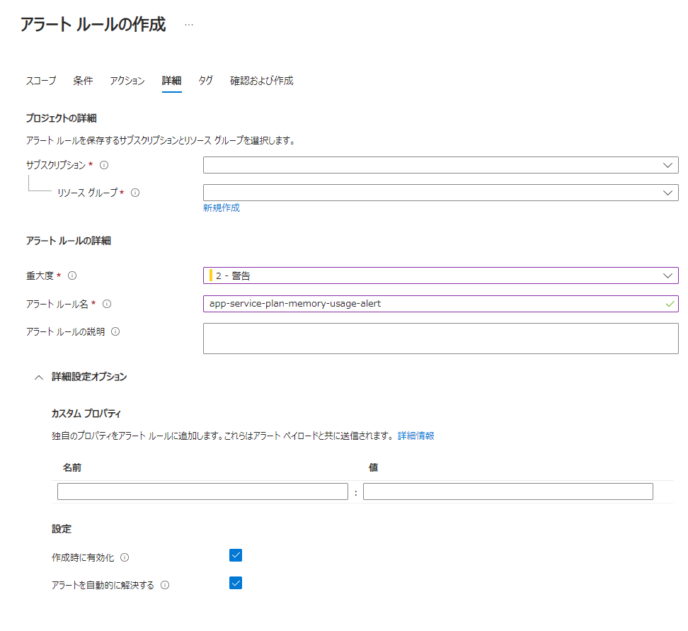

  - **確認および作成** をクリック

- 指定した内容を確認し **作成** をクリック

<br />

## Exercise 5: ストレージ アカウントの監視

### Task 1: 分析サービスを使用したストレージ サービスの監視

- ストレージ アカウントの管理ブレードを表示、左側のメニューで **分析情報** を選択

- **概要** タブでは、収集した様々なメトリックから情報を表示

  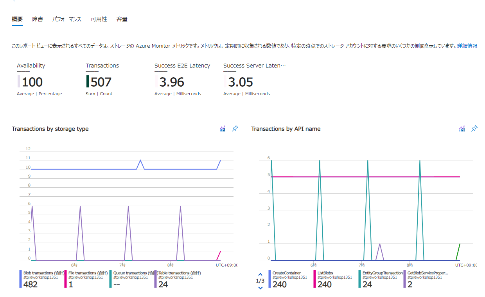

- **パフォーマンス** タブでは、成功した要求の待機時間を表示

  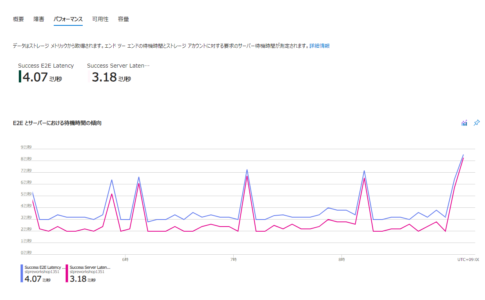

  ※Success E2E Latency：API 操作に対して行われた成功した要求の平均エンド ツー エンド待機時間

  ※Success Server Latency：成功した要求の平均処理時間

- **容量** タブでは、ストレージ アカウント内の各データ サービスによって使用されている容量を表示

  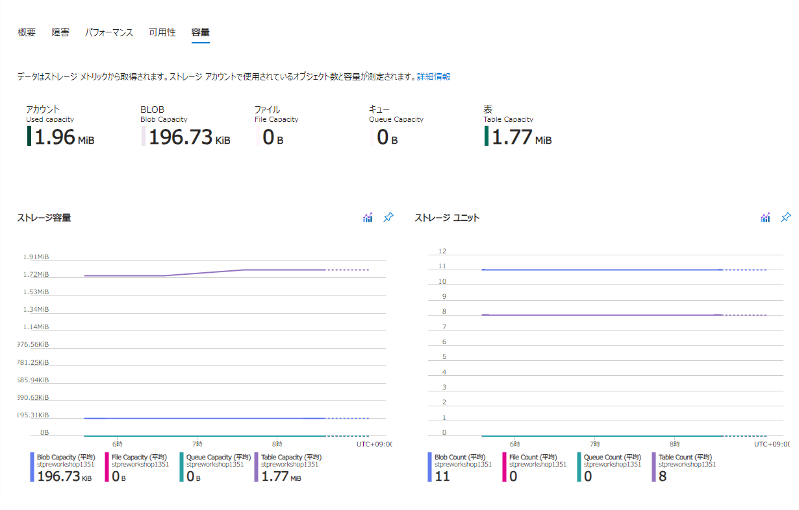

<br />

### 参考情報

- [Azure Monitor Storage 分析情報を使用したストレージ サービスの監視](https://learn.microsoft.com/ja-jp/azure/storage/common/storage-insights-overview)

- [Azure BLob Storage 監視データのリファレンス](https://learn.microsoft.com/ja-jp/azure/storage/blobs/monitor-blob-storage-reference)

<br />

### Task 2: Blob ストレージの監視

- 管理ブレードの左側のメニューで **ログ** を選択

- StorageBlobLogs テーブルに格納された情報を確認

  ```
  StorageBlobLogs
  | project TimeGenerated, OperationName, Uri, MetricResponseType
  ```

- 過去 12 時間で実行された操作を時間ごとに集計して表示

  ```
  StorageBlobLogs
  | where TimeGenerated > ago(12h)
  | summarize count() by bin(TimeGenerated, 1h), OperationName
  | render columnchart
  ```

- コンテナーに書き込まれたトランザクションの数と書き込まれたバイト数を取得

  ```
  StorageBlobLogs
  | where OperationName == "PutBlob" 
  | extend ContainerName = split(parse_url(Uri).Path, "/")[1]
  | summarize WriteSize = sum(RequestBodySize), WriteCount = count() by tostring(ContainerName)
  ```

<br />

### 参考情報

- [ログ リファレンス ‐ StorageBlobLogs](https://learn.microsoft.com/ja-jp/azure/azure-monitor/reference/tables/storagebloblogs)

<br />

## Exercise 6: SQL Database の監視

### Task 1: リソース消費が大きく、長時間実行されるクエリの特定

- SQL Database の管理ブレードへ移動、左側のメニューから **Query Performance Insights** を選択

- 画面上部で **リソース消費量の多いクエリ**, **実行時間の長いクエリ**, **カスタム** を切り替え

  **リソース消費量の多いクエリ**

  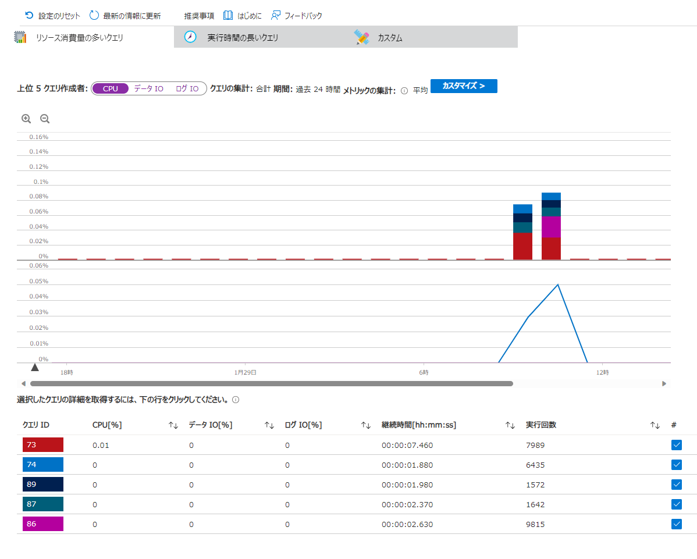

  **実行時間の長いクエリ**

  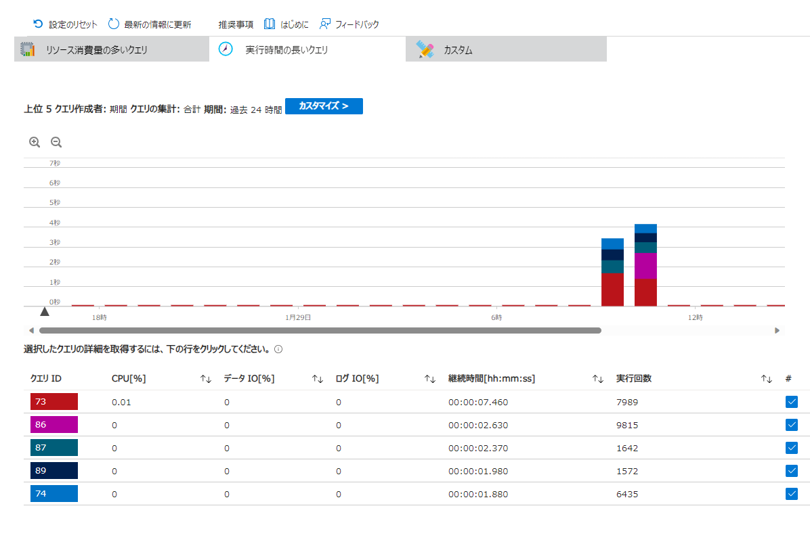

- 画面下部のテーブルにて CPU 消費量や実行回数を確認

- クエリを選択し詳細を確認

  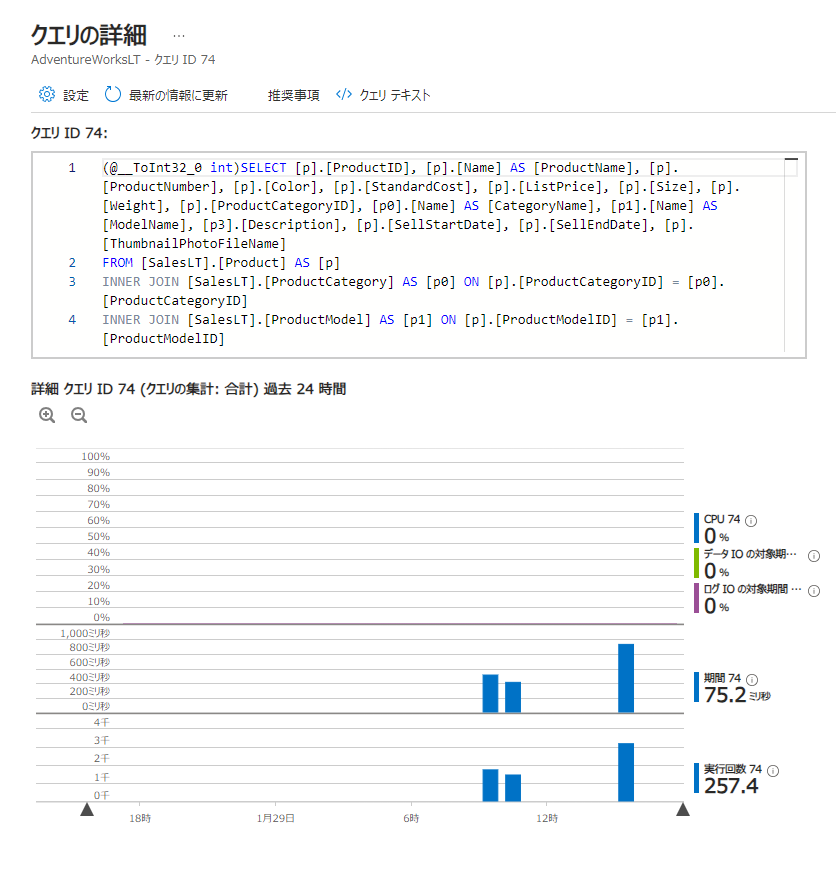

  ※CPU 消費量、実行回数などを時系列で表示

<br />

### Task 2: メトリックとアラートを使用した SQL Database の監視

- 管理ブレードの左側のメニューで **メトリック** を選択

- **SQL instance memory percent**, **CPU percentage** を選択

  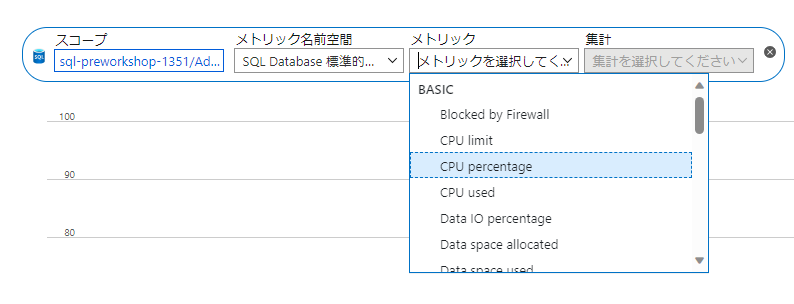

  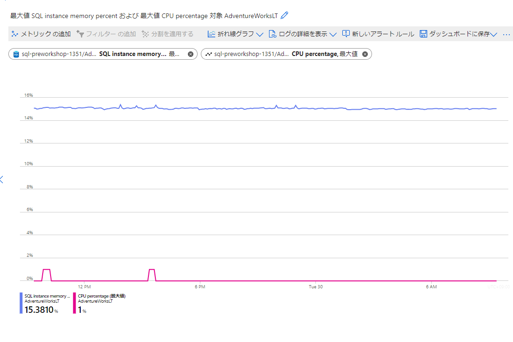

- **ログ** を選択

- クエリを使用し 1 日の最大、最小、平均の CPU 使用率を取得

  ```
  AzureMetrics
  | where ResourceProvider == "MICROSOFT.SQL"
  | where TimeGenerated >= ago(1d)
  | where MetricName in ('cpu_percent')
  | parse _ResourceId with * "/microsoft.sql/servers/" Resource
  | summarize CPU_Maximum_last1day = max(Maximum), CPU_Minimum_last1day = min(Minimum), CPU_Average_last1day = avg(Average) by Resource, MetricName
  ```

<br />

- ワーカースレッドの使用率、デッドロック、データ スペースの使用量、異常な接続速度を検出する４つのアラートを作成

- **警告** を選択、**＋ 作成** ‐ **アラート ルール** をクリック

- **アラート ルールの作成**

  - **条件**

    - **シグナル名**: Workers percentage

    - **アラート ロジック**

      - **しきい値**: Static

      - **集計の種類**: 最小

      - **演算子**: 次の値より大きい

      - **しきい値**: 60

    - **評価するタイミング**

      - **確認する間隔**: 1 分

      - **ルックバック期間**: 5 分

        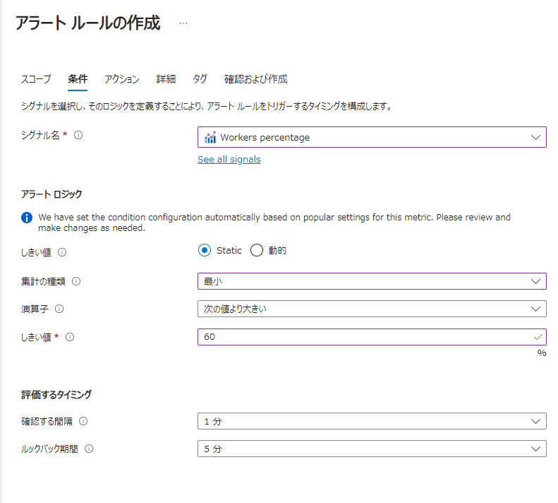
  
  - **アクション**

    - アクション グループの選択でワークショップ中に作成したアクション グループを選択

      

  - **詳細**

    - **プロジェクトの詳細**

      - **サブスクリプション**: ワークショップで使用中のサブスクリプション

      - **リソース グループ**: ワークショップで使用中のリソース グループ

    - **アラート ルールの詳細**

      - **重大度**: 2 ‐ 警告

      - **アラート ルール名**: high-worker-utilization (任意)
    
    - **詳細設定オプション**

      - **作成時に有効化**: オン

      - **アラートを自動的に解決する**: オン

        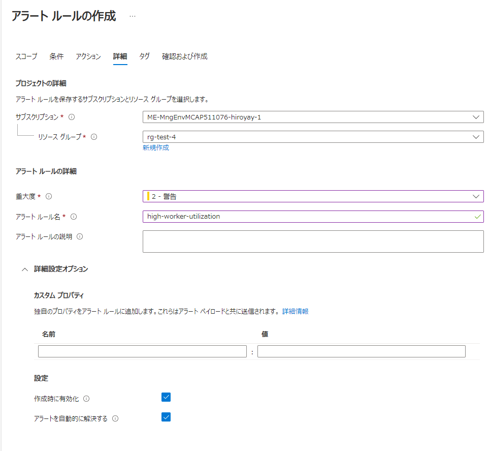

  - **確認および作成** をクリック

- 指定した内容を確認し **作成** をクリック

<br />

- **＋ 作成** ‐ **アラート ルール** をクリック

- **アラート ルールの作成**

  - **条件**

    - **シグナル名**: Deadlocks

    - **アラート ロジック**

      - **しきい値**: 動的

      - **集計の種類**: 合計

      - **演算子**: 次の値より大きい

      - **しきい値**: 中

    - **評価するタイミング**

      - **確認する間隔**: 15 分

      - **ルックバック期間**: 1 時間

        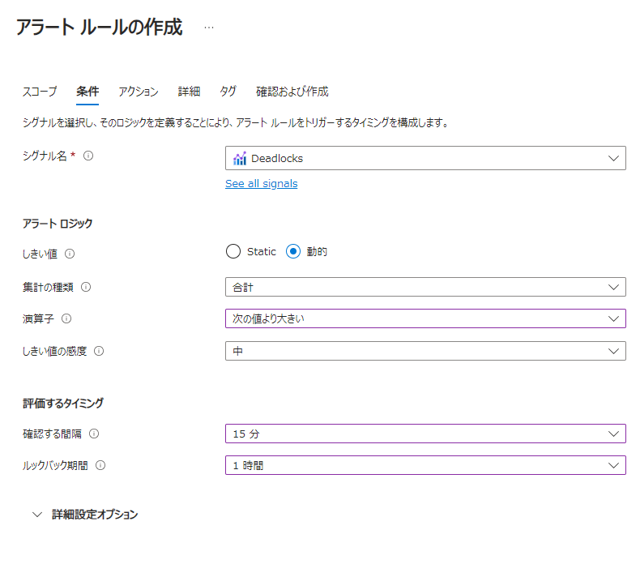
  
  - **アクション**

    - アクション グループの選択でワークショップ中に作成したアクション グループを選択

      

  - **詳細**

    - **プロジェクトの詳細**

      - **サブスクリプション**: ワークショップで使用中のサブスクリプション

      - **リソース グループ**: ワークショップで使用中のリソース グループ

    - **アラート ルールの詳細**

      - **重大度**: 3 ‐ 情報

      - **アラート ルール名**: deadlock (任意)
    
    - **詳細設定オプション**

      - **作成時に有効化**: オン

      - **アラートを自動的に解決する**: オン

        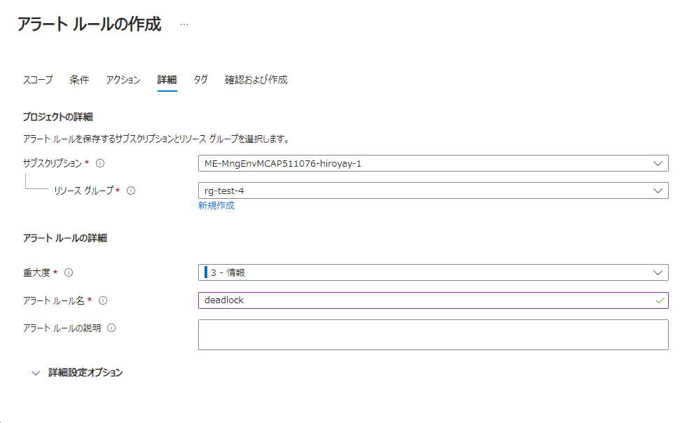

  - **確認および作成** をクリック

- 指定した内容を確認し **作成** をクリック

<br />

**＋ 作成** ‐ **アラート ルール** をクリック

- **アラート ルールの作成**

  - **条件**

    - **シグナル名**: Data space used percent

    - **アラート ロジック**

      - **しきい値**: Static

      - **集計の種類**: 最小

      - **演算子**: 次の値より大きい

      - **しきい値**: 95

    - **評価するタイミング**

      - **確認する間隔**: 15 分

      - **ルックバック期間**: 15 分

        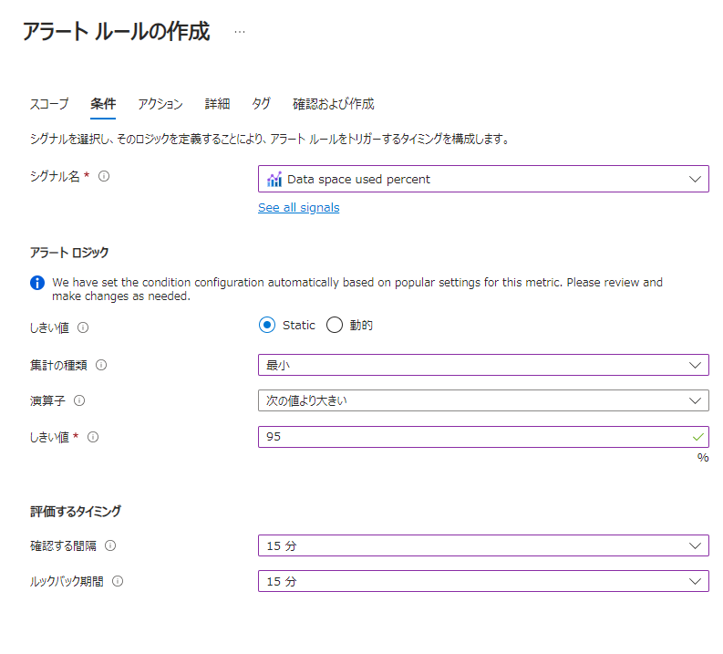
  
  - **アクション**

    - アクション グループの選択でワークショップ中に作成したアクション グループを選択

      

  - **詳細**

    - **プロジェクトの詳細**

      - **サブスクリプション**: ワークショップで使用中のサブスクリプション

      - **リソース グループ**: ワークショップで使用中のリソース グループ

    - **アラート ルールの詳細**

      - **重大度**: 1 ‐ エラー

      - **アラート ルール名**: low-data-spaces (任意)
    
    - **詳細設定オプション**

      - **作成時に有効化**: オン

      - **アラートを自動的に解決する**: オン

        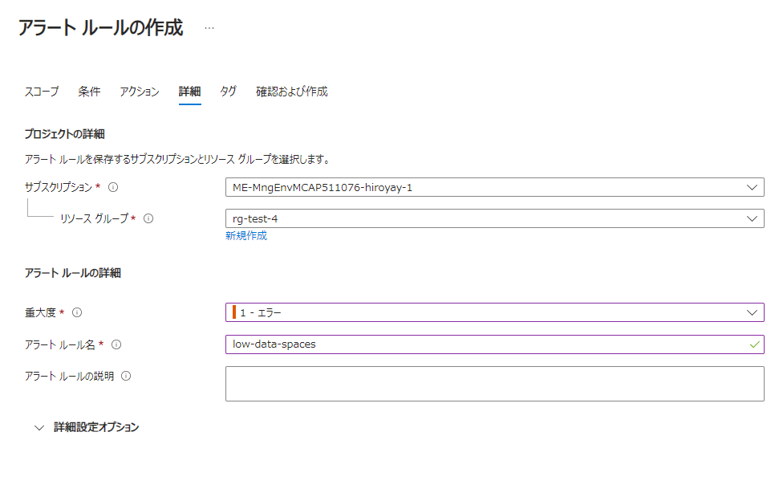

  - **確認および作成** をクリック

- 指定した内容を確認し **作成** をクリック

<br />

**＋ 作成** ‐ **アラート ルール** をクリック

- **アラート ルールの作成**

  - **条件**

    - **シグナル名**: Successful Connections

    - **アラート ロジック**

      - **しきい値**: 動的

      - **集計の種類**: 合計

      - **演算子**: より大きいまたはより小さい

      - **しきい値**: 低

    - **評価するタイミング**

      - **確認する間隔**: 5 分

      - **ルックバック期間**: 15 分

        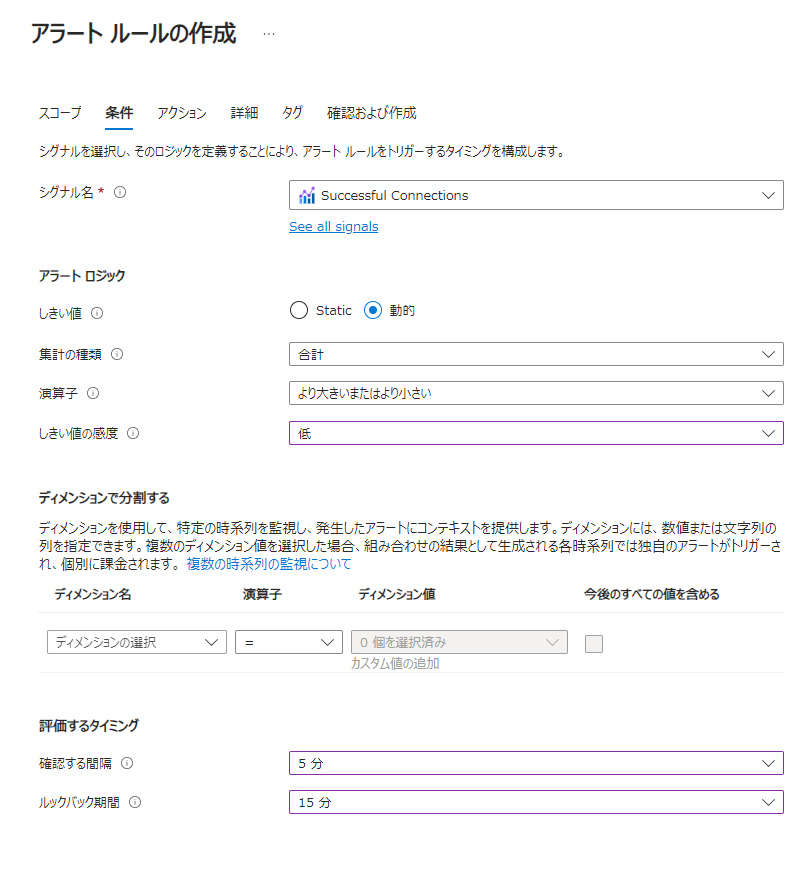
  
  - **アクション**

    - アクション グループの選択でワークショップ中に作成したアクション グループを選択

      

  - **詳細**

    - **プロジェクトの詳細**

      - **サブスクリプション**: ワークショップで使用中のサブスクリプション

      - **リソース グループ**: ワークショップで使用中のリソース グループ

    - **アラート ルールの詳細**

      - **重大度**: 2 ‐ 警告

      - **アラート ルール名**: connection-alert (任意)
    
    - **詳細設定オプション**

      - **作成時に有効化**: オン

      - **アラートを自動的に解決する**: オン

        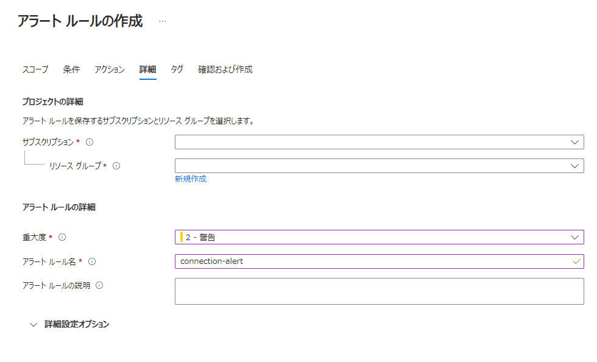

  - **確認および作成** をクリック

- 指定した内容を確認し **作成** をクリック

<br />

### 参考情報

- [メトリックとアラートを使用して Azure SQL Database を監視する](https://learn.microsoft.com/ja-jp/azure/azure-sql/database/monitoring-metrics-alerts?view=azuresql-db)

<br />

### Task 3: 監査ログの分析

- 管理ブレードの左側のメニューで **ログ** を選択

- クエリを使用し監査ログを取得、**＞** をログを展開

  ```
  AzureDiagnostics
  | where Category == 'SQLSecurityAuditEvents' 
  | sort by TimeGenerated desc
  | project TimeGenerated, succeeded_s, LogicalServerName_s, database_name_s, client_ip_s, application_name_s, server_principal_name_s, statement_s
  ```

  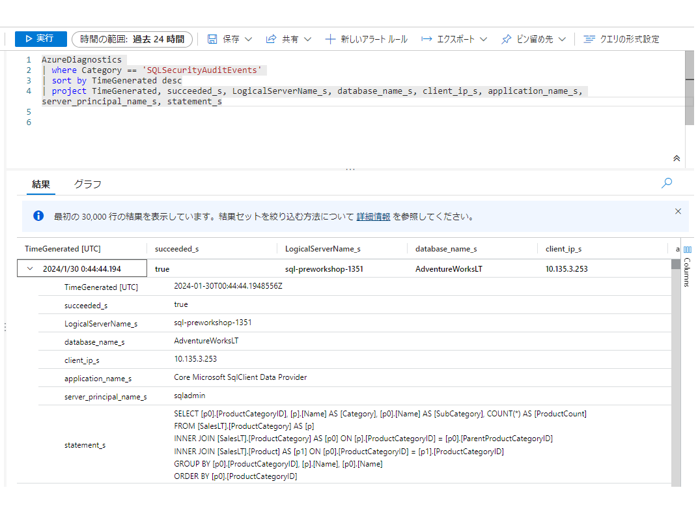

  ※statement_s 列に実行された T-SQL ステートメントを格納

<br />

### 参考情報

- [SQL Database 監査ログの形式](https://learn.microsoft.com/ja-jp/azure/azure-sql/database/audit-log-format?view=azuresql)

<br />
